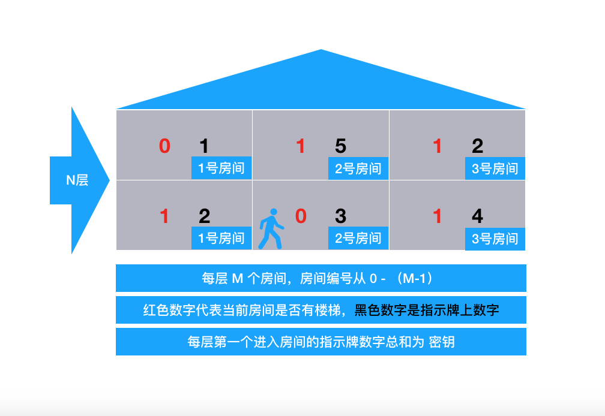

# 寻宝

## 题目描述

传说很遥远的藏宝楼顶层藏着诱人的宝藏。小明历尽千辛万苦终于找到传说中的这个藏宝楼，藏宝楼的门口竖着一个木板，上面写有几个大字：寻宝说明书。说明书的内容如下：

藏宝楼共有 `N+1`层，最上面一层是顶层，顶层有一个房间里面藏着宝藏。除了顶层外，藏宝楼另
 `0` 到 `N` 层，每层 `M` 个房间，这 `M`  个房间围成一圈并按逆时针方向依次编号为 `0` ,…, `M − 1` 。其中一些房间有通往上一层的楼梯，每层楼的楼梯设计可能不同。每个房间里有一个指示牌，指示牌上有一个数字 `x` ，表示从这个房间开始按逆时针方向选择第 `x` 个有楼梯的房间（假定该房间的编号为 `k` ），从该房间上楼，上楼后到达上一层的
 `k` 号房间。比如当前房间的指示牌上写着 `2` ，则按逆时针方向开始尝试，找到第 `2` 个有楼梯的房间，从该房间上楼。如果当前房间本身就有楼梯通向上层，该房间作为第一个有楼梯的房间。

寻宝说明书的最后用红色大号字体写着：“寻宝须知：帮助你找到每层上楼房间的指示牌上的数字（即每层第一个进入的房间内指示牌上的数字）总和为打开宝箱的密钥”。

请帮助小明算出这个打开宝箱的密钥。

## 输入输出格式

### 输入格式：

第一行 `2` 个整数 `N` 和 `M` ，之间用一空格隔开。 `N` 表示除了顶层外藏宝楼共 `N` 层楼， `M` 表示除顶层外每层楼有 `M` 个房间。

接下来 `N × M` 行，每行两个整数，之间用一个空格隔开，每行描述一个房间内的情况，其中第 `(i−1)×M+j` 行表示第 `i` 层 `j−1`号房间的情况 `（i=1,2,…,N；j=1,2,…,M）` 。第一个整数表示该房间是否有楼梯通往上一层（
 `0` 表示没有， `1` 表示有），第二个整数表示指示牌上的数字。注意，从 `j` 号房间的楼梯爬到上一层到达的房间一定也是 `j` 号房间。

最后一行，一个整数，表示小明从藏宝楼底层的几号房间进入开始寻宝（注：房间编号从 `0` 开始）。

## 输出格式：
一个整数，表示打开宝箱的密钥，这个数可能会很大，请输出对
20123取模的结果即可。

### 输入输出样例

#### 输入样例#1：

```
2 3
1 2
0 3
1 4
0 1
1 5
1 2
1
```

### 输出样例#1
    5

## 说明

### 数据范围

对于 `50%` 数据，有 `0<N≤10000<x≤10000`；
对于 `100%` 数据，有
`0<N≤10000,0<M≤100,0<x≤1,000,000` .

    NOIP 2012 普及组 第二题

## 解题思路




1. 声明俩个数组分别接收当前房间是否有楼梯和指示牌数字；
2. for() 循环，塔有多少层，循环多少次；
3. 在 for() 循环中，定义一个 `sum` 变量累加每层第一个进入房间的指示牌数字；
4. 在 for() 循环中嵌套一个for（），有多少房间，循环多少次，判断每个房间是否有楼梯，如果有则累加，得知每层楼有 `ams` 个房间是有楼梯的；
5. 拿第一个房间指示牌数字 `x` 对 `ams` 取余，得到余数 `r` ，当  `r` == `0` 时，遍历到第 `ams` 个房间，当  `r` ！= `0` 时，从当前房间遍历到第 `r` 个有楼梯的房间，即为第 `x`号房间，此时跳出循环;
6. `sum` 对 `20123` 取模，输出结果； 


## 代码演示

```C++
#include <iostream>
using namespace std;
int a[10001][101],b[10001][101];
int main()
{
    int n,m,k,r;
    int sum=0;
    cin>>n>>m;
    
    for(int i=1;i<=n;i++)
    {
        for(int j=0;j<=m-1;j++)
        {
            cin>>a[i][j]>>b[i][j];
        }
    }
    cin>>k;
    
    for(int i=1;i<=n;i++)
    {
        sum=(sum+b[i][k])%20123;
        int ans=0;
        int ams=0;
        int q=k;
        
        for(int j=0;j<=m-1;j++)
        {
            if(a[i][j]==1)
                ams++;
        }
        r=b[i][q]%ams;  //0~ams-1
        if(r==0)
            r=ams;
        
        while(ans < r)
        {
            ans+=a[i][k];
            if(ans==r)
                break;
            k++;
            if(k==m)
                k=0;
        }
    }
    cout<<sum<<endl;
    
    return 0;
}
```