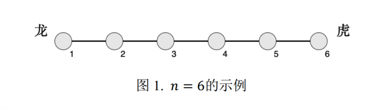
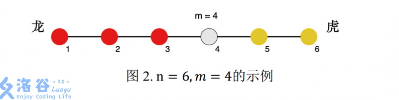

# 模拟题练习

## P2010 回文日期

### 题目描述

在日常生活中，通过年、月、日这三个要素可以表示出一个唯一确定的日期。

牛牛习惯用8位数字表示一个日期，其中，前 `4`位代表年份，接下来 `2` 位代表月份，最后 `2` 位代表日期。显然：一个日期只有一种表示方法，而两个不同的日期的表 示方法不会相同。

牛牛认为，一个日期是回文的，当且仅当表示这个日期的8位数字是回文的。现 在，牛牛想知道：在他指定的两个日期之间包含这两个日期本身），有多少个真实存 在的日期是回文的。

一个 `8` 位数字是回文的，当且仅当对于所有 `i` `(1≤i≤8)` 从左向右数的第 `i` 个数字和第 `9−i` 个数字（即从右向左数的第 `i` 个数字）是相同的。

例如：

• 对于 `2016` 年 `11` 月 `19` 日，用 `8` 位数字 `20161119` 表示，它不是回文的。

• 对于 `2010` 年 `1` 月 `2` 日，用 `8` 位数字 `20100102` 表示，它是回文的。

• 对于 `2010` 年 `10` 月 `2` 日，用 `8` 位数字 `20101002` 表示，它不是回文的。

每一年中都有 `12` 个月份：

其中 `1,3,5,7,8,10,12` 月每个月有 `31` 天； `4,6,9,11` 月每个月有 `30` 天；而对于 `2` 月，闰年时有 `29` 天，平年时有 `28` 天。

一个年份是闰年当且仅当它满足下列两种情况其中的一种：

1. 这个年份是 `4` 的整数倍，但不是 `100` 的整数倍；

2. 这个年份是 `400` 的整数倍。

例如：

• 以下几个年份都是闰年：`2000,2012,2016`。

• 以下几个年份是平年： `1900,2011,2014`。

### 输入输出格式

#### 输入格式：

两行，每行包括一个 `8` 位数字。

第一行表示牛牛指定的起始日期。

第二行表示牛牛指定的终止日期。

保证 `date_i` 和都是真实存在的日期，且年份部分一定为 `4` 位数字，且首位数字不为 `0`。

保证 `date1` —定不晚于 `date2` 。

#### 输出格式：

一个整数，表示在 `date1`和 `date2` 之间，有多少个日期是回文的。

### 输入输出样例

#### 输入样例#1： 复制


20110101

20111231

#### 输出样例#1： 复制
1

#### 输入样例#2： 复制

20000101

20101231

#### 输出样例#2： 复制
2

### 说明

#### 【样例说明】

对于样例1，符合条件的日期是
20111102。

对于样例2，符合条件的日期是
20011002和
20100102。

#### 【子任务】

对于60%的数据，满足date1=date2。

### 解题思路

#### 思路一

1. 假设在符合回文日期的情况下，输入 `8` 位数对 `10000` 取模得到后四位，后四位再分别对 `100` 取整和取余，得到月和日；
2. 判断当前月和日是否合法（如月不等于0且小于等于12）；
3. 如果合法则对后四位逆序输出得到年份；
4. `8` 位数对 `10000` 取整，得到4四位年份数字，如果该四位数字与根据月日算出来的合法年份一致，则计数器 `+1` ,否则进入下一次循环；
5. 输出计数器的值。

#### 思路二

1. 声明两个数组分别存放闰年、平年 `1-12` 月每月的天数；
2. 假设在符合回文日期的前提下，输入对 `10000`取整得到年份，对年份逆序，分别得到月和日；
3. `if` 语句判断该年是闰年还是平年；
4. 在 `if` 语句里判断月和日是否符合条件（如：月不等于 `0` 且小于 `12` ，日是否小于以当前月份为数组下表的值且同样不等于 `0` ），如果满足条件则计数器加 `1` ,不满足则进入下一次循环；
5. 输出计数器的值。

### 代码样例（思路二）
```C++
#include<iostream>
using namespace std;
int main()
{
	
	int count=0;
	int array[13]={0,31,28,31,30,31,30,31,31,30,31,30,31};
	int brray[13]={0,31,29,31,30,31,30,31,31,30,31,30,31};
	int m=0,d=0;
	long long y1,y2;
	cin>>y1>>y2;
	int ya,yb;
	ya=(int)y1/10000;
	yb=(int)y2/10000;
	
	for(int i=ya;i<=yb;i++)
	{
		int j=i;
		int sum=0;
		for(int z=1;z<=4;z++)
		{
			sum=sum*10+j%10;
			j=j/10;
		}
		
		m=sum/100;
		d=sum%100;
		if((j%4==0 && j%100!=0) || j%400==0)
		{
			while(m!=0 && m<=12)
			{
				if(d<=brray[m] && d>0)
					count++;
				break;
			}	
		}
		else
		{
			while(m!=0 && m<=12)
			{
				if(d<=array[m] && d>0)
					count++;
				break;
			}	
		}		
	}
	cout<<count<<endl;

	return 0;
} 
```

## 图书管理员

### 题目描述

图书馆中每本书都有一个 `图书编码` ，可以用于快速检索图书，这个图书编码是一个正整数。 每位借书的读者手中有一个 `需求码` ，这个需求码也是一个正整数。如果一本书的图 书编码恰好以读者的需求码结尾，那么这本书就是这位读者所需要的。 小 D 刚刚当上图书馆的管理员，她知道图书馆里所有书的图书编码，她请你帮她写 一个程序，对于每一位读者，求出他所需要的书中图书编码最小的那本书，如果没有他 需要的书，请输出 `−1`。

### 输入输出格式

#### 输入格式：
第一行，包含两个正整数 `n,q`，以一个空格分开，分别代表图书馆里 书的数量和读者的数量。

接下来的 `n` 行，每行包含一个正整数，代表图书馆里某本书的图书编码。

接下来的 `q` 行，每行包含两个正整数，以一个空格分开，第一个正整数代表图书馆 里读者的需求码的长度，第二个正整数代表读者的需求码。

#### 输出格式：
`q` 行，每行包含一个整数，如果存在第 `i`个读者所需要的书，则在第 `i` 行输出第 `i` 个读者所需要的书中图书编码最小的那本书的图书编码，否则输出 `−1`。

#### 输入输出样例

##### 输入样例#1：
``` 
5 5 
2123 
1123 
23 
24 
24 
2 23 
3 123 
3 124 
2 12 
2 12
```
##### 输出样例#1：
```
23 
1123 
-1 
-1 
-1 
```

### 说 明

- 对于 `20%` 的数据，`1≤n≤2` ;
- 另有 `20%` 的数据，`q=1`;
- 另有 `20%` 的数据，所有读者的需求码的长度均为 `1`;
- 另有 `20%` 的数据，所有的图书编码按从小到大的顺序给出;
- 对于 `100%` 的数据 `1≤n≤1,000,1≤q≤1,000` ，所有的图书编码和需求码均不超过 
`10,000,000` 。

### 解题思路

1. 声明一个 `num[]` 数组用来存放所有的图书编码；
2. 对该数组排序；
3. 关于读者的需求码。我们采用边读取边操作的手法；
4. `for()` 循环中，采用传说中的 `m[]` 数组，即 `int m[8]={1,10,100,1000,10000,100000,1000000,10000000};` 根据需求码长度对 `num[]` 数组中的图书编码取模；
5. 用取的模与需求码比较，相同则输出图书编码，不同进入下一轮循环，数组中没有对应需求码则输出 `-1` 。

### 代码展示
```C++
#include<bits/stdc++.h>
using namespace std;
int main()
{
	int n,q;
	int ans;
	int flag;
	int len,number;
	int num[1005];
	int m[9]={1,10,100,1000,10000,100000,1000000,10000000,100000000};
	cin>>n>>q;
	for(int i=1;i<=n;i++)
	{
		cin>>num[i];
	}
	
	for(int i=1;i<=n-1;i++)
	{
		for(int j=i+1;j<=n;j++)
		{
			if(num[i]>=num[j])
			{
				int swap=num[i];
				num[i]=num[j];
				num[j]=swap;
			}
		}
	}
	
	while(q--)
	{
		flag=-1;
		cin>>len>>number;
		for(int i=1;i<=n;i++)
		{
			if(number==num[i]%m[len])
			{
				ans=num[i];
				flag=1;
				break;
			}
		}
		if(flag==1)
			cout<<ans<<endl;
		else
			cout<<flag<<endl;
	}
	return 0;
}
```


## 寻宝

### 题目描述

传说很遥远的藏宝楼顶层藏着诱人的宝藏。小明历尽千辛万苦终于找到传说中的这个藏宝楼，藏宝楼的门口竖着一个木板，上面写有几个大字：寻宝说明书。说明书的内容如下：

藏宝楼共有 `N+1`层，最上面一层是顶层，顶层有一个房间里面藏着宝藏。除了顶层外，藏宝楼另
 `0` 到 `N` 层，每层 `M` 个房间，这 `M`  个房间围成一圈并按逆时针方向依次编号为 `0` ,…, `M − 1` 。其中一些房间有通往上一层的楼梯，每层楼的楼梯设计可能不同。每个房间里有一个指示牌，指示牌上有一个数字 `x` ，表示从这个房间开始按逆时针方向选择第 `x` 个有楼梯的房间（假定该房间的编号为 `k` ），从该房间上楼，上楼后到达上一层的
 `k` 号房间。比如当前房间的指示牌上写着 `2` ，则按逆时针方向开始尝试，找到第 `2` 个有楼梯的房间，从该房间上楼。如果当前房间本身就有楼梯通向上层，该房间作为第一个有楼梯的房间。

寻宝说明书的最后用红色大号字体写着：“寻宝须知：帮助你找到每层上楼房间的指示牌上的数字（即每层第一个进入的房间内指示牌上的数字）总和为打开宝箱的密钥”。

请帮助小明算出这个打开宝箱的密钥。

### 输入输出格式

#### 输入格式：

第一行 `2` 个整数 `N` 和 `M` ，之间用一空格隔开。 `N` 表示除了顶层外藏宝楼共 `N` 层楼， `M` 表示除顶层外每层楼有 `M` 个房间。

接下来 `N × M` 行，每行两个整数，之间用一个空格隔开，每行描述一个房间内的情况，其中第 `(i−1)×M+j` 行表示第 `i` 层 `j−1`号房间的情况 `（i=1,2,…,N；j=1,2,…,M）` 。第一个整数表示该房间是否有楼梯通往上一层（
 `0` 表示没有， `1` 表示有），第二个整数表示指示牌上的数字。注意，从 `j` 号房间的楼梯爬到上一层到达的房间一定也是 `j` 号房间。

最后一行，一个整数，表示小明从藏宝楼底层的几号房间进入开始寻宝（注：房间编号从 `0` 开始）。

### 输出格式：
一个整数，表示打开宝箱的密钥，这个数可能会很大，请输出对
20123取模的结果即可。

#### 输入输出样例

##### 输入样例#1：

```
2 3
1 2
0 3
1 4
0 1
1 5
1 2
1
```

#### 输出样例#1
    5

### 说明

#### 数据范围

对于 `50%` 数据，有 `0<N≤10000<x≤10000`；
对于 `100%` 数据，有
`0<N≤10000,0<M≤100,0<x≤1,000,000` .

    NOIP 2012 普及组 第二题

### 解题思路


1. 声明俩个数组分别接收当前房间是否有楼梯和指示牌数字；
2. for() 循环，塔有多少层，循环多少次；
3. 在 for() 循环中，定义一个 `sum` 变量累加每层第一个进入房间的指示牌数字；
4. 在 for() 循环中嵌套一个for（），有多少房间，循环多少次，判断每个房间是否有楼梯，如果有则累加，得知每层楼有 `ams` 个房间是有楼梯的；
5. 拿第一个房间指示牌数字 `x` 对 `ams` 取余，得到余数 `r` ，当  `r` == `0` 时，遍历到第 `ams` 个房间，当  `r` ！= `0` 时，从当前房间遍历到第 `r` 个有楼梯的房间，即为第 `x`号房间，此时跳出循环;
6. `sum` 对 `20123` 取模，输出结果； 


### 代码演示

```C++
#include <iostream>
using namespace std;
int a[10001][101],b[10001][101];
int main()
{
    int n,m,k,r;
    int sum=0;
    cin>>n>>m;
    
    for(int i=1;i<=n;i++)
    {
        for(int j=0;j<=m-1;j++)
        {
            cin>>a[i][j]>>b[i][j];
        }
    }
    cin>>k;
    
    for(int i=1;i<=n;i++)
    {
        sum=(sum+b[i][k])%20123;
        int ans=0;
        int ams=0;
        int q=k;
        
        for(int j=0;j<=m-1;j++)
        {
            if(a[i][j]==1)
                ams++;
        }
        r=b[i][q]%ams;  //0~ams-1
        if(r==0)
            r=ams;
        
        while(ans < r)
        {
            ans+=a[i][k];
            if(ans==r)
                break;
            k++;
            if(k==m)
                k=0;
        }
    }
    cout<<sum<<endl;
    
    return 0;
}
```

## P2188 比例简化

### 题目描述

在社交媒体上，经常会看到针对某一个观点同意与否的民意调查以及结果。例如，对某一观点表示支持的有 `1498` 人，反对的有 `902` 人，那么赞同与反对的比例可以简单的记为 `1498:902`。

不过，如果把调查结果就以这种方式呈现出来，大多数人肯定不会满意。因为这个比例的数值太大，难以一眼看出它们的关系。对于上面这个例子，如果把比例记为 `5:3` ，虽然与真实结果有一定的误差，但依然能够较为准确地反映调查结果，同时也显得比较直观。

现给出支持人数 `A` ，反对人数 `B` ，以及一个上限 `L` ，请你将 `A` 比 `B` 化简为`A’`比 `B’`，要求在 `A’`和 `B’` 均不大 `L` 且 `A’` 和 `B’` 互质（两个整数的最大公约数是 `1` ）的前提下，`A’/B’≥A/B` 且`A’/B’−A/B` 的值尽可能小。

(本题目为 `2014NOIP` 普及 `T2` )

### 输入输出格式

#### 输入格式：
共一行，包含三个整数
`A,B,L` ，每两个整数之间用一个空格隔开，分别表示支持人数、反对人数以及上限。

#### 输出格式：
共一行，包含两个整数 `A’`，`B’`，中间用一个空格隔开，表示化简后的比例。

#### 输入输出样例

##### 输入样例#1： 复制
1498 902 10
#### 输出样例#1： 复制
5 3

### 说 明

对于 `100%` 的数据，
`1≤A≤1,000,000,1≤B≤1,000,000,1≤L≤100,A/B≤L`。

### 解题思路
1.  此题采用逆向思维，开局围绕范围 `L` 展开；
2.  嵌套 `for()` 循环，范围是 `L*L` ，找出满足 `A'、B'` 互为质数; `A'、B'>=a/b;A'、B'<=ansa/ansb`;
3. 在此嵌套循环中，不断更新 `A‘ B’` 的值，只要出现 `A’/B’−A/B` 的值更小，就更新；
4. 循环结束，输出此时最小的 `A‘ B’` 即可。

### 代码展示

```C++
#include<iostream>
using namespace std;

//判断俩个数是否互质
int gcd(int x,int y){
    if(y==0) return x;
    return gcd(y,x%y);
}
int main(){
    int i,j,a,b,ansa,ansb,l;
    
    cin>>a>>b>>l;
    
    ansa=l;
    ansb=1;
    
    for(i=1;i<=l;i++)
    {
        for(j=1;j<=l;j++)
        {
            if(gcd(i,j)==1 && i*b>=j*a && i*ansb<j*ansa)    //i、j互为质数;i/j>=a/b;i/j<=ansa/ansb;
            {
                ansa=i;
                ansb=j;
            }
        }
    }
    cout<<ansa<<" "<<ansb<<endl;
    return 0;
}
```
## P2141 珠心算测验

### 题目描述

珠心算是一种通过在脑中模拟算盘变化来完成快速运算的一种计算技术。珠心算训练，既能够开发智力，又能够为日常生活带来很多便利，因而在很多学校得到普及。

某学校的珠心算老师采用一种快速考察珠心算加法能力的测验方法。他随机生成一个正整数集合，集合中的数各不相同，然后要求学生回答：其中有多少个数，恰好等于集合中另外两个（不同的）数之和？

最近老师出了一些测验题，请你帮忙求出答案。

(本题目为 `2014NOIP` 普及 `T1` )

### 输入输出格式

#### 输入格式：

共两行，第一行包含一个整数 `n`，表示测试题中给出的正整数个数。

第二行有 `n` 个正整数，每两个正整数之间用一个空格隔开，表示测试题中给出的正整数。

#### 输出格式：  

一个整数，表示测验题答案。

#### 输入输出样例

##### 输入样例#1： 复制
4  
1 2 3 4  

##### 输出样例#1： 复制
2 

### 说 明

#### 【样例说明】
由 `1+2=3,1+3=4`，故满足测试要求的答案 `2`。

注意，加数和被加数必须是集合中的两个不同的数。

#### 【数据说明】

对于 `100%` 的数据，`3≤n≤100` ，测验题给出的正整数大小不超过 `10,000` 。

### 解题思路
1. 声明一个数组来接收手动输入的所有真正数；
2. 再声明一个数组 `array[10005]` 初始化为 `0`；
2. 对该数组内的值从小到大排序；
3. 嵌套循环，从数组头开始依次两两相加，判断和是否也在数组中，如果存在，则以两数相加的和为 `array[10005]` 数组下标自加（注意，这里是重点，这里我们将两数之和重复部分也自加进去，会在下一步想办法去掉）
4. 遍历 `array[10005]` 数组，若数组值不为 `0`，则累加器 `+1`，如此一来，所有重复的值都当做不为 `0` 来处理，巧妙的化解了和重复的问题。

### 代码展示
```C++
#include<iostream>
using namespace std;
int main()
{
	
	int num;
	int swap;
	int sum;
	int count=0;
	int nums[105];
	int array[10005]={0};
	cin>>num;
	for(int i=1;i<=num;i++)	//数组接收 num 个正整数； 
	{
		cin>>nums[i];
	}
	
	for(int i=1;i<num;i++)	//对数组中的数排序； 
	{
		for(int j=i;j<num;j++)
		{
			if(nums[i]>nums[j+1])
			{
				swap=nums[i];
				nums[i]=nums[j+1];
				nums[j+1]=swap;
			}
		}
	}
	
	for(int i=1;i<=num-2;i++)	//数组从前向后，俩个数相加，判断相加之和是否属于数组； 
	{
		for(int j=i+1;j<=num-1;j++)
		{
			sum=nums[i]+nums[j];
			
			for(int k=1;k<=num;k++)
			{
				if(sum==nums[k])	//如果相加之和与数组中一个数相等，则计数器加 1； 
				{
					array[sum]++;
					break;	
				}
			}
		}
	}

	for(int i=1;i<10005;i++)
	{
		while(array[i]!=0)
		{
			count++;
			break;	
		}
	}
	cout<<count<<endl;
	return 0;
} 
```

# 模拟练习

## P2010 回文日期

### 题目描述

在日常生活中，通过年、月、日这三个要素可以表示出一个唯一确定的日期。

牛牛习惯用8位数字表示一个日期，其中，前 `4`位代表年份，接下来 `2` 位代表月份，最后 `2` 位代表日期。显然：一个日期只有一种表示方法，而两个不同的日期的表 示方法不会相同。

牛牛认为，一个日期是回文的，当且仅当表示这个日期的8位数字是回文的。现 在，牛牛想知道：在他指定的两个日期之间包含这两个日期本身），有多少个真实存 在的日期是回文的。

一个 `8` 位数字是回文的，当且仅当对于所有 `i` `(1≤i≤8)` 从左向右数的第 `i` 个数字和第 `9−i` 个数字（即从右向左数的第 `i` 个数字）是相同的。

例如：

• 对于 `2016` 年 `11` 月 `19` 日，用 `8` 位数字 `20161119` 表示，它不是回文的。

• 对于 `2010` 年 `1` 月 `2` 日，用 `8` 位数字 `20100102` 表示，它是回文的。

• 对于 `2010` 年 `10` 月 `2` 日，用 `8` 位数字 `20101002` 表示，它不是回文的。

每一年中都有 `12` 个月份：

其中 `1,3,5,7,8,10,12` 月每个月有 `31` 天； `4,6,9,11` 月每个月有 `30` 天；而对于 `2` 月，闰年时有 `29` 天，平年时有 `28` 天。

一个年份是闰年当且仅当它满足下列两种情况其中的一种：

1. 这个年份是 `4` 的整数倍，但不是 `100` 的整数倍；

2. 这个年份是 `400` 的整数倍。

例如：

• 以下几个年份都是闰年：`2000,2012,2016`。

• 以下几个年份是平年： `1900,2011,2014`。

### 输入输出格式

#### 输入格式：

两行，每行包括一个 `8` 位数字。

第一行表示牛牛指定的起始日期。

第二行表示牛牛指定的终止日期。

保证 `date_i` 和都是真实存在的日期，且年份部分一定为 `4` 位数字，且首位数字不为 `0`。

保证 `date1` —定不晚于 `date2` 。

#### 输出格式：

一个整数，表示在 `date1`和 `date2` 之间，有多少个日期是回文的。

### 输入输出样例

#### 输入样例#1： 复制


20110101

20111231

#### 输出样例#1： 复制
1

#### 输入样例#2： 复制

20000101

20101231

#### 输出样例#2： 复制
2

### 说明

#### 【样例说明】

对于样例1，符合条件的日期是
20111102。

对于样例2，符合条件的日期是
20011002和
20100102。

#### 【子任务】

对于60%的数据，满足date1=date2。

### 解题思路

#### 思路一

1. 假设在符合回文日期的情况下，输入 `8` 位数对 `10000` 取模得到后四位，后四位再分别对 `100` 取整和取余，得到月和日；
2. 判断当前月和日是否合法（如月不等于0且小于等于12）；
3. 如果合法则对后四位逆序输出得到年份；
4. `8` 位数对 `10000` 取整，得到4四位年份数字，如果该四位数字与根据月日算出来的合法年份一致，则计数器 `+1` ,否则进入下一次循环；
5. 输出计数器的值。

#### 思路二

1. 声明两个数组分别存放闰年、平年 `1-12` 月每月的天数；
2. 假设在符合回文日期的前提下，输入对 `10000`取整得到年份，对年份逆序，分别得到月和日；
3. `if` 语句判断该年是闰年还是平年；
4. 在 `if` 语句里判断月和日是否符合条件（如：月不等于 `0` 且小于 `12` ，日是否小于以当前月份为数组下表的值且同样不等于 `0` ），如果满足条件则计数器加 `1` ,不满足则进入下一次循环；
5. 输出计数器的值。

### 代码样例（思路二）
```C++
#include<iostream>
using namespace std;
int main()
{
	
	int count=0;
	int array[13]={0,31,28,31,30,31,30,31,31,30,31,30,31};
	int brray[13]={0,31,29,31,30,31,30,31,31,30,31,30,31};
	int m=0,d=0;
	long long y1,y2;
	cin>>y1>>y2;
	int ya,yb;
	ya=(int)y1/10000;
	yb=(int)y2/10000;
	
	for(int i=ya;i<=yb;i++)
	{
		int j=i;
		int sum=0;
		for(int z=1;z<=4;z++)
		{
			sum=sum*10+j%10;
			j=j/10;
		}
		
		m=sum/100;
		d=sum%100;
		if((j%4==0 && j%100!=0) || j%400==0)
		{
			while(m!=0 && m<=12)
			{
				if(d<=brray[m] && d>0)
					count++;
				break;
			}	
		}
		else
		{
			while(m!=0 && m<=12)
			{
				if(d<=array[m] && d>0)
					count++;
				break;
			}	
		}		
	}
	cout<<count<<endl;

	return 0;
} 
```

## 图书管理员

### 题目描述

图书馆中每本书都有一个 `图书编码` ，可以用于快速检索图书，这个图书编码是一个正整数。 每位借书的读者手中有一个 `需求码` ，这个需求码也是一个正整数。如果一本书的图 书编码恰好以读者的需求码结尾，那么这本书就是这位读者所需要的。 小 D 刚刚当上图书馆的管理员，她知道图书馆里所有书的图书编码，她请你帮她写 一个程序，对于每一位读者，求出他所需要的书中图书编码最小的那本书，如果没有他 需要的书，请输出 `−1`。

### 输入输出格式

#### 输入格式：
第一行，包含两个正整数 `n,q`，以一个空格分开，分别代表图书馆里 书的数量和读者的数量。

接下来的 `n` 行，每行包含一个正整数，代表图书馆里某本书的图书编码。

接下来的 `q` 行，每行包含两个正整数，以一个空格分开，第一个正整数代表图书馆 里读者的需求码的长度，第二个正整数代表读者的需求码。

#### 输出格式：
`q` 行，每行包含一个整数，如果存在第 `i`个读者所需要的书，则在第 `i` 行输出第 `i` 个读者所需要的书中图书编码最小的那本书的图书编码，否则输出 `−1`。

#### 输入输出样例

##### 输入样例#1：
``` 
5 5 
2123 
1123 
23 
24 
24 
2 23 
3 123 
3 124 
2 12 
2 12
```
##### 输出样例#1：
```
23 
1123 
-1 
-1 
-1 
```

### 说 明

- 对于 `20%` 的数据，`1≤n≤2` ;
- 另有 `20%` 的数据，`q=1`;
- 另有 `20%` 的数据，所有读者的需求码的长度均为 `1`;
- 另有 `20%` 的数据，所有的图书编码按从小到大的顺序给出;
- 对于 `100%` 的数据 `1≤n≤1,000,1≤q≤1,000` ，所有的图书编码和需求码均不超过 
`10,000,000` 。

### 解题思路

1. 声明一个 `num[]` 数组用来存放所有的图书编码；
2. 对该数组排序；
3. 关于读者的需求码。我们采用边读取边操作的手法；
4. `for()` 循环中，采用传说中的 `m[]` 数组，即 `int m[8]={1,10,100,1000,10000,100000,1000000,10000000};` 根据需求码长度对 `num[]` 数组中的图书编码取模；
5. 用取的模与需求码比较，相同则输出图书编码，不同进入下一轮循环，数组中没有对应需求码则输出 `-1` 。

### 代码展示
```C++
#include<bits/stdc++.h>
using namespace std;
int main()
{
	int n,q;
	int ans;
	int flag;
	int len,number;
	int num[1005];
	int m[9]={1,10,100,1000,10000,100000,1000000,10000000,100000000};
	cin>>n>>q;
	for(int i=1;i<=n;i++)
	{
		cin>>num[i];
	}
	
	for(int i=1;i<=n-1;i++)
	{
		for(int j=i+1;j<=n;j++)
		{
			if(num[i]>=num[j])
			{
				int swap=num[i];
				num[i]=num[j];
				num[j]=swap;
			}
		}
	}
	
	while(q--)
	{
		flag=-1;
		cin>>len>>number;
		for(int i=1;i<=n;i++)
		{
			if(number==num[i]%m[len])
			{
				ans=num[i];
				flag=1;
				break;
			}
		}
		if(flag==1)
			cout<<ans<<endl;
		else
			cout<<flag<<endl;
	}
	return 0;
}
```


## 寻宝

### 题目描述

传说很遥远的藏宝楼顶层藏着诱人的宝藏。小明历尽千辛万苦终于找到传说中的这个藏宝楼，藏宝楼的门口竖着一个木板，上面写有几个大字：寻宝说明书。说明书的内容如下：

藏宝楼共有 `N+1`层，最上面一层是顶层，顶层有一个房间里面藏着宝藏。除了顶层外，藏宝楼另
 `0` 到 `N` 层，每层 `M` 个房间，这 `M`  个房间围成一圈并按逆时针方向依次编号为 `0` ,…, `M − 1` 。其中一些房间有通往上一层的楼梯，每层楼的楼梯设计可能不同。每个房间里有一个指示牌，指示牌上有一个数字 `x` ，表示从这个房间开始按逆时针方向选择第 `x` 个有楼梯的房间（假定该房间的编号为 `k` ），从该房间上楼，上楼后到达上一层的
 `k` 号房间。比如当前房间的指示牌上写着 `2` ，则按逆时针方向开始尝试，找到第 `2` 个有楼梯的房间，从该房间上楼。如果当前房间本身就有楼梯通向上层，该房间作为第一个有楼梯的房间。

寻宝说明书的最后用红色大号字体写着：“寻宝须知：帮助你找到每层上楼房间的指示牌上的数字（即每层第一个进入的房间内指示牌上的数字）总和为打开宝箱的密钥”。

请帮助小明算出这个打开宝箱的密钥。

### 输入输出格式

#### 输入格式：

第一行 `2` 个整数 `N` 和 `M` ，之间用一空格隔开。 `N` 表示除了顶层外藏宝楼共 `N` 层楼， `M` 表示除顶层外每层楼有 `M` 个房间。

接下来 `N × M` 行，每行两个整数，之间用一个空格隔开，每行描述一个房间内的情况，其中第 `(i−1)×M+j` 行表示第 `i` 层 `j−1`号房间的情况 `（i=1,2,…,N；j=1,2,…,M）` 。第一个整数表示该房间是否有楼梯通往上一层（
 `0` 表示没有， `1` 表示有），第二个整数表示指示牌上的数字。注意，从 `j` 号房间的楼梯爬到上一层到达的房间一定也是 `j` 号房间。

最后一行，一个整数，表示小明从藏宝楼底层的几号房间进入开始寻宝（注：房间编号从 `0` 开始）。

### 输出格式：
一个整数，表示打开宝箱的密钥，这个数可能会很大，请输出对
20123取模的结果即可。

#### 输入输出样例

##### 输入样例#1：

```
2 3
1 2
0 3
1 4
0 1
1 5
1 2
1
```

#### 输出样例#1
    5

### 说明

#### 数据范围

对于 `50%` 数据，有 `0<N≤10000<x≤10000`；
对于 `100%` 数据，有
`0<N≤10000,0<M≤100,0<x≤1,000,000` .

    NOIP 2012 普及组 第二题

### 解题思路


1. 声明俩个数组分别接收当前房间是否有楼梯和指示牌数字；
2. for() 循环，塔有多少层，循环多少次；
3. 在 for() 循环中，定义一个 `sum` 变量累加每层第一个进入房间的指示牌数字；
4. 在 for() 循环中嵌套一个for（），有多少房间，循环多少次，判断每个房间是否有楼梯，如果有则累加，得知每层楼有 `ams` 个房间是有楼梯的；
5. 拿第一个房间指示牌数字 `x` 对 `ams` 取余，得到余数 `r` ，当  `r` == `0` 时，遍历到第 `ams` 个房间，当  `r` ！= `0` 时，从当前房间遍历到第 `r` 个有楼梯的房间，即为第 `x`号房间，此时跳出循环;
6. `sum` 对 `20123` 取模，输出结果； 


### 代码演示

```C++
#include <iostream>
using namespace std;
int a[10001][101],b[10001][101];
int main()
{
    int n,m,k,r;
    int sum=0;
    cin>>n>>m;
    
    for(int i=1;i<=n;i++)
    {
        for(int j=0;j<=m-1;j++)
        {
            cin>>a[i][j]>>b[i][j];
        }
    }
    cin>>k;
    
    for(int i=1;i<=n;i++)
    {
        sum=(sum+b[i][k])%20123;
        int ans=0;
        int ams=0;
        int q=k;
        
        for(int j=0;j<=m-1;j++)
        {
            if(a[i][j]==1)
                ams++;
        }
        r=b[i][q]%ams;  //0~ams-1
        if(r==0)
            r=ams;
        
        while(ans < r)
        {
            ans+=a[i][k];
            if(ans==r)
                break;
            k++;
            if(k==m)
                k=0;
        }
    }
    cout<<sum<<endl;
    
    return 0;
}
```

## P2188 比例简化

### 题目描述

在社交媒体上，经常会看到针对某一个观点同意与否的民意调查以及结果。例如，对某一观点表示支持的有 `1498` 人，反对的有 `902` 人，那么赞同与反对的比例可以简单的记为 `1498:902`。

不过，如果把调查结果就以这种方式呈现出来，大多数人肯定不会满意。因为这个比例的数值太大，难以一眼看出它们的关系。对于上面这个例子，如果把比例记为 `5:3` ，虽然与真实结果有一定的误差，但依然能够较为准确地反映调查结果，同时也显得比较直观。

现给出支持人数 `A` ，反对人数 `B` ，以及一个上限 `L` ，请你将 `A` 比 `B` 化简为`A’`比 `B’`，要求在 `A’`和 `B’` 均不大 `L` 且 `A’` 和 `B’` 互质（两个整数的最大公约数是 `1` ）的前提下，`A’/B’≥A/B` 且`A’/B’−A/B` 的值尽可能小。

(本题目为 `2014NOIP` 普及 `T2` )

### 输入输出格式

#### 输入格式：
共一行，包含三个整数
`A,B,L` ，每两个整数之间用一个空格隔开，分别表示支持人数、反对人数以及上限。

#### 输出格式：
共一行，包含两个整数 `A’`，`B’`，中间用一个空格隔开，表示化简后的比例。

#### 输入输出样例

##### 输入样例#1： 复制
1498 902 10
#### 输出样例#1： 复制
5 3

### 说 明

对于 `100%` 的数据，
`1≤A≤1,000,000,1≤B≤1,000,000,1≤L≤100,A/B≤L`。

### 解题思路
1.  此题采用逆向思维，开局围绕范围 `L` 展开；
2.  嵌套 `for()` 循环，范围是 `L*L` ，找出满足 `A'、B'` 互为质数; `A'、B'>=a/b;A'、B'<=ansa/ansb`;
3. 在此嵌套循环中，不断更新 `A‘ B’` 的值，只要出现 `A’/B’−A/B` 的值更小，就更新；
4. 循环结束，输出此时最小的 `A‘ B’` 即可。

### 代码展示

```C++
#include<iostream>
using namespace std;

//判断俩个数是否互质
int gcd(int x,int y){
    if(y==0) return x;
    return gcd(y,x%y);
}
int main(){
    int i,j,a,b,ansa,ansb,l;
    
    cin>>a>>b>>l;
    
    ansa=l;
    ansb=1;
    
    for(i=1;i<=l;i++)
    {
        for(j=1;j<=l;j++)
        {
            if(gcd(i,j)==1 && i*b>=j*a && i*ansb<j*ansa)    //i、j互为质数;i/j>=a/b;i/j<=ansa/ansb;
            {
                ansa=i;
                ansb=j;
            }
        }
    }
    cout<<ansa<<" "<<ansb<<endl;
    return 0;
}
```
## P2141 珠心算测验

### 题目描述

珠心算是一种通过在脑中模拟算盘变化来完成快速运算的一种计算技术。珠心算训练，既能够开发智力，又能够为日常生活带来很多便利，因而在很多学校得到普及。

某学校的珠心算老师采用一种快速考察珠心算加法能力的测验方法。他随机生成一个正整数集合，集合中的数各不相同，然后要求学生回答：其中有多少个数，恰好等于集合中另外两个（不同的）数之和？

最近老师出了一些测验题，请你帮忙求出答案。

(本题目为 `2014NOIP` 普及 `T1` )

### 输入输出格式

#### 输入格式：

共两行，第一行包含一个整数 `n`，表示测试题中给出的正整数个数。

第二行有 `n` 个正整数，每两个正整数之间用一个空格隔开，表示测试题中给出的正整数。

#### 输出格式：  

一个整数，表示测验题答案。

#### 输入输出样例

##### 输入样例#1： 复制
4  
1 2 3 4  

##### 输出样例#1： 复制
2 

### 说 明

#### 【样例说明】
由 `1+2=3,1+3=4`，故满足测试要求的答案 `2`。

注意，加数和被加数必须是集合中的两个不同的数。

#### 【数据说明】

对于 `100%` 的数据，`3≤n≤100` ，测验题给出的正整数大小不超过 `10,000` 。

### 解题思路
1. 声明一个数组来接收手动输入的所有真正数；
2. 再声明一个数组 `array[10005]` 初始化为 `0`；
2. 对该数组内的值从小到大排序；
3. 嵌套循环，从数组头开始依次两两相加，判断和是否也在数组中，如果存在，则以两数相加的和为 `array[10005]` 数组下标自加（注意，这里是重点，这里我们将两数之和重复部分也自加进去，会在下一步想办法去掉）
4. 遍历 `array[10005]` 数组，若数组值不为 `0`，则累加器 `+1`，如此一来，所有重复的值都当做不为 `0` 来处理，巧妙的化解了和重复的问题。

### 代码展示
```C++
#include<iostream>
using namespace std;
int main()
{
	
	int num;
	int swap;
	int sum;
	int count=0;
	int nums[105];
	int array[10005]={0};
	cin>>num;
	for(int i=1;i<=num;i++)	//数组接收 num 个正整数； 
	{
		cin>>nums[i];
	}
	
	for(int i=1;i<num;i++)	//对数组中的数排序； 
	{
		for(int j=i;j<num;j++)
		{
			if(nums[i]>nums[j+1])
			{
				swap=nums[i];
				nums[i]=nums[j+1];
				nums[j+1]=swap;
			}
		}
	}
	
	for(int i=1;i<=num-2;i++)	//数组从前向后，俩个数相加，判断相加之和是否属于数组； 
	{
		for(int j=i+1;j<=num-1;j++)
		{
			sum=nums[i]+nums[j];
			
			for(int k=1;k<=num;k++)
			{
				if(sum==nums[k])	//如果相加之和与数组中一个数相等，则计数器加 1； 
				{
					array[sum]++;
					break;	
				}
			}
		}
	}

	for(int i=1;i<10005;i++)
	{
		while(array[i]!=0)
		{
			count++;
			break;	
		}
	}
	cout<<count<<endl;
	return 0;
} 
```


# P5016 龙虎斗

### 题目描述

轩轩和凯凯正在玩一款叫《龙虎斗》的游戏，游戏的棋盘是一条线段，线段上有 `n` 个兵营（自左至右编号 `1∼n` ），相邻编号的兵营之间相 `1` 厘米，即棋盘为长度为 `n−1` 厘米的线段。`i` 号兵营里有 `ci`位工兵。 下面图 `1` 为 `n=6` 的示例：



轩轩在左侧，代表 `“龙”` ；凯凯在右侧，代表`“虎”`。 他们以 `m` 号兵营作为分界，靠左的工兵属于龙势力，靠右的工兵属于虎势力，而第 
`m` 号兵营中的工兵很纠结，他们不属于任何一方。

一个兵营的气势为：**该兵营中的工兵数
× 该兵营到 `m` 号兵营的距离**；参与游戏 一方的势力定义为：属于这一方所有兵营的气势之和。下面图 `2` 为 `n=6,m=4` 的示例，其中红色为龙方，黄色为虎方：



游戏过程中，某一刻天降神兵，共有 `s1` 位工兵突然出现在了 `p1` 号兵营。作为轩轩和凯凯的朋友，你知道如果龙虎双方气势差距太悬殊，轩轩和凯凯就不愿意继续玩下去了。为了让游戏继续，你需要选择一个兵营，并将你手里的 `s2`位工兵全部派往 兵营 `p2`，使得双方气势差距尽可能小。

注意：你手中的工兵落在哪个兵营，就和该兵营中其他工兵有相同的势力归属（如果落在 
`m` 号兵营，则不属于任何势力）。

### 输入输出格式

#### 输入格式：

输入文件的第一行包含一个正整数 `n` ，代表兵营的数量。

接下来的一行包含 `n` 个正整数，相邻两数之间以一个空格分隔，第 `i` 个正整数代 表编号为 
`i` 的兵营中起始时的工兵数量 `ci`。

接下来的一行包含四个正整数，相邻两数间以一个空格分隔，分别代表 `m,p1,s1,s2`。

#### 输出格式：

输出文件有一行，包含一个正整数，即 `p2`，表示你选择的兵营编号。如果存在多个编号同时满足最优，取最小的编号。

#### 输入输出样例

##### 输入样例#1
6  
2 3 2 3 2 3   
4 6 5 2   

##### 输出样例#1
2 

##### 输入样例#2
6   
1 1 1 1 1 16   
5 4 1 1

##### 输出样例#2
1

### 说明

#### 输入输出样例 1 说明

见问题描述中的图 `2` 。
双方以 `m=4` 号兵营分界，有 `s1=5` 位工兵突然出现在 `p1=6` 号兵营。  
龙方的气势为：`2×(4−1)+3×(4−2)+2×(4−3)=14`  
虎方的气势为：`2×(5−4)+(3+5)×(6−4)=18`

当你将手中的 `s2 =2` 位工兵派往 `p2=2` 号兵营时，  
龙方的气势变为：`14+2×(4−2)=18`

此时双方气势相等。

#### 输入输出样例 2 说明

双方以 `m=5` 号兵营分界，有 `s1=1` 位工兵突然出现在 `p1=4` 号兵营。  
龙方的气势为：
`1×(5−1)+1×(5−2)+1×(5−3)+(1+1)×(5−4)=11`
虎方的气势为：`16×(6−5)=16`

当你将手中的 `s2=1` 位工兵派往 `p2=1` 号兵营时，  
龙方的气势变为：`11+1×(5−1)=15`

此时可以使双方气势的差距最小。

【数据规模与约定】
`1<m<n,1≤p1≤n`。
对于20% 的数据,`n=3,m=2,ci=1,s1,s2≤100`。
另有 `20%` 的数据，`n≤10,p 1=m,ci =1,s1,s2≤100`。
对于 `60%` 的数据，`n≤100,c i=1,s1,s2≤100` 。
对于 `80%` 的数据 `n≤100^5,ci,s1,s2≤100` 。
对于 `100%` 的数据，`n≤10^5,ci,s1,s2≤10^9` 。

### 解题思路

1. 声明一个数组存放 `1-n` 每个兵营的士兵数量；
2. 根据 `m` 号兵营利用 `if` 语句分别算出龙势力和虎势力，比较其势力大小，决定我手中的工兵派往势力相对弱的一方；
3. 声明一个变量用来存放双方势力差值；
4. 利用循环将我手中工兵依次放入势力弱的一方，然后与势力强的一方比较，记录势力差值，如果势力差值比上一次的势力差值小，则更新最小差值，记录此时的兵营编号；
5. 循环结束，输出势力差值最小时对应的兵营编号；


### 代码展示

```C++
#include<bits/stdc++.h>
using namespace std;

long long abs(long long x, long long y)
{
	if(x>=y)	return x-y;
	else	return y-x;
}

int main()
{
	long long m,p1,p2;
	int n;
	long long s1,s2;
	long long dragon=0,tiger=0;
	long long soldier[100005];
	long long min=1e19;
	
	cin>>n;
	for(int i=1;i<=n;i++)
	{
		cin>>soldier[i];
	}
	cin>>m>>p1>>s1>>s2;
	
	soldier[p1]=soldier[p1]+s1;
	
	for(int i=1;i<m;i++)
	{
		dragon+=soldier[i]*(m-i);
	}
	 
	for(int j=m+1;j<=n;j++)
	{
		tiger+=soldier[j]*(j-m);
	}
	
	for(int i = 1; i <= n; i ++ ) {
        if(i < m) dragon += (m - i) * s2;
        else if(i > m) tiger += (i - m) * s2;//算出新的双方势力
        long long tmp = abs(dragon, tiger);//相减后算绝对值
        if(min > tmp) {
            min = tmp;
            p2 = i;
        }
        if(i < m) dragon -= (m - i) * s2;
        else if(i > m) tiger -= (i - m) * s2;//退栈
    }
	
	cout<<p2<<endl;
	
	return 0;
}
```


## 质因数分解

### 题目描述

    已知正整数 `n` 是两个不同的质数的乘积，试求出两者中较大的那个质数。

### 输入输出格式
#### 输入格式：
    一个正整数 `n`。

#### 输出格式：
    一个正整数 `p` ，即较大的那个质数

#### 输入输出样例:
##### 输入样例#1： 
    21
##### 输出样例#1： 
    7

#### 说明
    n≤2×10^9
    NOIP 2012 普及组 第一题


### 解题思路

#### 常规思路：
```
1. 利用for（）循环从 `2` 到 `sqrt(n)` 找出能被 `n` 整除的数；
2. 判断这个数是否为质数，不是质数则进入下一次循环；
3. 是质数则拿 `n` 除以这个质数，能整除则得到正整数 `p` ；
4. 此时判断 `p` 是否为质数，是的话直接输出 `p`，不是质数继续回到 for() 循环；
5. 费尽心机写出来，结果 submit 时发现超时来；
```
    此题的关键是样例 `n` 的输入，题目开始已经告诉我们它是俩个不同质数的成绩，则我们在样例测试时会找到符合条件数据输入；

#### 正确思路：

```
1. 利用for（）循环从 `2` 到 `sqrt(n)` 找出能被 `n` 整除的最小质数；
2. 直接输出结果： `n` 除去这个最小质数得到最大质数；
```

### 代码展示
```C++
#include<iostream>
using namespace std;
int main()
{
    int n;
    cin>>n;
    for(int i=2;i<n/2;i++)
    {
        if(n%i==0)
        {
            cout<<n/i<<endl;
            break;
        }
    }
    return 0;
}
```