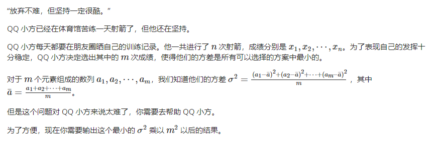
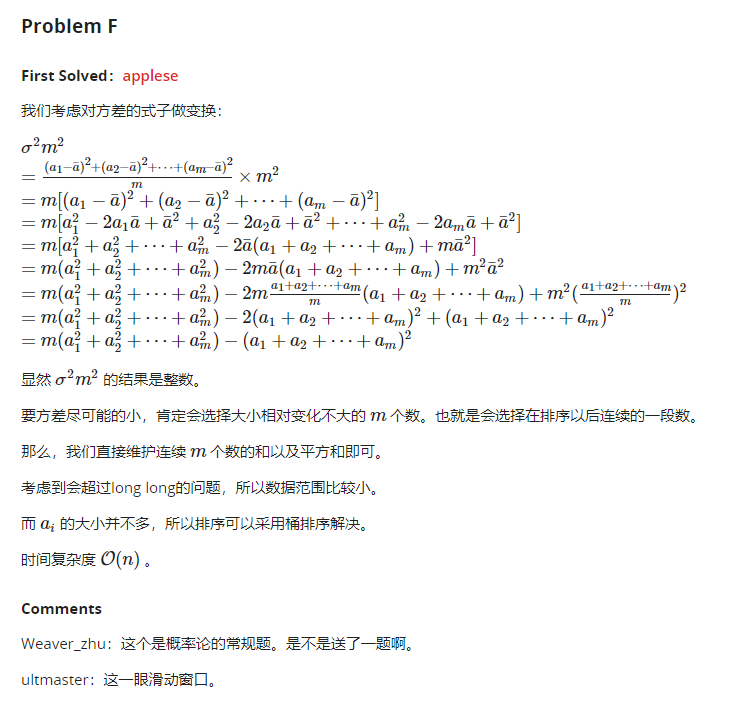

# 小学数学题

本章节考点小学数学难度，不过看出来需要一些，你懂我意思吧

## 进制转换

- 进制转换，前缀和 https://acm.ecnu.edu.cn/problem/3679/

他现在想知道在十进制范围 [l,r] 内有多少整数满足在 k 进制下末尾恰好有 m 个 0。

比如在十进制下的 24 在二进制下是 11000，我们称十进制下的 24 在二进制下末尾恰好有 3 个 0。

QQ 小方一筹莫展，你能帮他解决问题吗？

### 思路


### Code

```c++
#include <bits/stdc++.h>
using namespace std;
typedef long long LL;

LL l, r, k, m;

LL fpow(LL a, LL b, LL up) {
	if(b * log(a) > log(up)) return -1;
	LL ret = 1;
	for(int i = 1; i <= b; i++) {
		ret = ret * a;
		if(ret > up) return -1;
	}
	return ret;
}

LL solve(LL l, LL r, LL k, LL m) {
	// [l, r] x * k ^ m
	LL base = fpow(k, m, r);
	if (base == -1) return 0;
	LL R = r / base;
	LL L = (l - 1) / base;
	return R - L;
}

int main () {
	int T; for (scanf("%d", &T); T--; ) {
		scanf("%lld%lld%lld%lld", &l, &r, &k, &m);
		LL res = solve(l, r, k, m) - solve(l, r, k, m + 1);
		printf("%lld\n", res);
	}
	return 0;
}
```


## 方差

- 完全平法，方差 https://acm.ecnu.edu.cn/problem/3678/



### 题解



### 代码


```c++
#include <bits/stdc++.h>
#define sqr(x) x*x
using namespace std;
typedef long long LL;
const int N = 1e6 + 7;

LL n, m, x[N];

int main(){
    scanf("%lld%lld", &n, &m);
    for (int i = 1; i <= n; i++){
        scanf("%lld", &x[i]);
    }
    sort(x + 1, x + n+1);

    LL sum = 0, sum2 = 0;
    for (int i = 1; i <= m; i++){
        sum += x[i];
        sum2 += sqr(x[i]);
    }
    
    LL ans = m * sum2 - sqr(sum);
    for (int i = m+1; i <= n; i++){
        sum += x[i] - x[i-m];
        sum2 += sqr(x[i]) - sqr(x[i-m]);
        ans = min(ans, m*sum2 - sqr(sum));
    }
    printf("%lld\n", ans);
    return 0;
}
```
