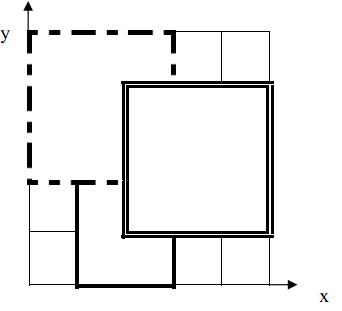

# 铺地毯

## 题目描述

为了准备一个独特的颁奖典礼，组织者在会场的一片矩形区域（可看做是平面直角坐标系的第一象限）铺上一些矩形地毯。一共有 `n `张地毯，编号从 `1` 到 `n`。现在将这些地毯按照编号从小到大的顺序平行于坐标轴先后铺设，后铺的地毯覆盖在前面已经铺好的地毯之上。

地毯铺设完成后，组织者想知道覆盖地面某个点的最上面的那张地毯的编号。注意：在矩形地毯边界和四个顶点上的点也算被地毯覆盖。


## 输入格式：

输入共 `n+2` 行

第一行，一个整数 `n`, 表示总共有 `n` 张地毯

接下来的 `n` 行中，第 `i+1` 行表示编号i的地毯的信息，包含四个正整数 `a,b,g,k`, 每两个整数之间用一个空格隔开，分别表示铺设地毯的左下角的坐标 `(a,b)` 以及地毯在 `x` 轴和 `y` 轴方向的长度

第`n+2`行包含两个正整数 `x` 和 `y`，表示所求的地面的点的坐标`(x,y)`

## 输出格式：

输出共1行，一个整数，表示所求的地毯的编号；若此处没有被地毯覆盖则输出 `−1`。

## 输入样例#1： 

    3
    1 0 2 3
    0 2 3 3
    2 1 3 3
    2 2

## 输出样例#1： 

    3

## 输入样例#2： 

    3
    1 0 2 3
    0 2 3 3
    2 1 3 3
    4 5

## 输出样例#2：

    -1

## 样例解释

如下图，`1` 号地毯用实线表示，`2` 号地毯用虚线表示，`3`号用双实线表示，覆盖点`(2,2)`的最上面一张地毯是 3 号地毯。



## 数据范围

- 对于30% 的数据，有 `n≤2 `；
- 对于50% 的数据，`0 ≤a, b, g, k≤100`；
- 对于100%的数据，有` 0 ≤n ≤10,000`， `0≤ a, b, g, k ≤10,000` 。

noip2011提高组day1第1题

## 题解

拿到一道题首先要理解题意。此题比较容易理解，求出地面上某个点最上面的地毯编号。接着再看输入格式，此处给出解题可用条件。给出条件包括，地毯左下标坐标`(a,b)`及地毯在x轴和y轴长度信息`(g,k)`，还有所求点坐标。

理解题意及所给求解信息后，要从所求量着手挖掘隐藏条件来解题。例如此题，要求所给点的最上层地毯，必须要确定一个点是否在所给地毯所占区域内，怎么确定是这个题目的关键。一件地毯知道左下标又知道其在 `x` 轴和 `y` 轴上的长度，即可知道地毯`x`，`y`轴边界值（`x`轴范围为 `[a,a+g]`，`y`轴范围为`[b,b+k]`），只要所求点横纵坐标在边界范围内包括边界，即可认定此点被该地毯覆盖。

确定大概方法后，接着要思考数据，此题所给数据都在 `100 000` 以内，且求解没有累乘和累加，故用int整型就可以。

接着可以着手写程序，先些输入数据程序，需要设置一个二维矩阵表示 `n` 张地毯信息。

## 代码示例

```c++
#include <iostream>
#include<cstdio>
using namespace std;
int m[10001][5];
int main(int argc, char** argv) {
	int n;
	scanf("%d",&n);
	int i,j,flag=0;
	for (i=1;i<=n;i++){
		scanf("%d",&m[i][1]);//a
		scanf("%d",&m[i][2]);//b
		scanf("%d",&m[i][3]);//g
		scanf("%d",&m[i][4]);//k	
	}
	int x,y;
	scanf("%d",&x);
	scanf("%d",&y);
//搜索最顶上地毯，有两种方法，一种从第一张搜到最后一张，另一种从最后搜起，搜到的
//第一张即为最顶上一张。很明显第二种搜索次数小于或等于第一种方法，所以选择第二种。
	for (j=n;j>0;j--){
		if((x<=m[j][1]+m[j][3])&&(x>=m[j][1])&&(y>=m[j][2] && (y<=m[j][2]+m[j][4]))) {
				cout<<j;
				flag=1;
				break; //搜到最顶层地毯退出循环
		}
	}

	if (flag==0){
			cout<<-1;//没有符合条件的地毯，输出“-1”
	}

	return 0;
}
```