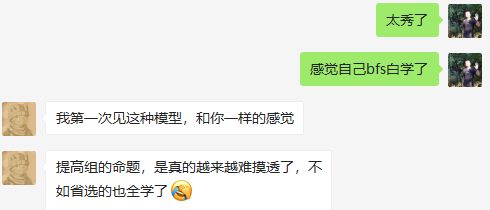

# 搜索建模1

## CF1070A Find a Number

给定两个数 `d(1≤d≤500)`和`s(1≤s≤5000)`，找出最小数n使得`d ∣ n`且`n`的各个位数之和为`s`。

### 样例
输入|输出 
---|---
13 50 | 699998
61 2 | 1000000000000000000000000000001
15 50 | -1

### 思路

取模最短路，感觉这个套路提高组要会的，很经典的取模最短路，POJ1426是差不多的题目

就是通常的BFS，加个二维`vis[d][s]`表示取模为`d`，各位之和为`s`的字符串是否被生成过

比较暴力的代码大概是这样的

### Code

```c++
#include <bits/stdc++.h>
using namespace std;

struct Node{
    int d, s;
    string ans;
};
int d, s;
bool vis[505][5005];

string bfs(){
    queue <Node> Q;
    vis[0][0] = true;
    for (Q.push(Node{0, 0, ""}); !Q.empty();){
        Node cur = Q.front(); Q.pop();
        if (cur.d == 0 && cur.s == s) return cur.ans;
        for (int i = 0; i < 10; i++){
            int dd = (cur.d * 10 + i) % d;
            int ss = cur.s + i;
            if (ss <= s && !vis[dd][ss]){
                vis[dd][ss] = true;
                Q.push(Node{dd, ss, cur.ans + (char)(i+'0')});
            }
        }
    }
    return "-1";
}

int main(int argc, char** argv) {
    scanf("%d%d", &d, &s);
    cout << bfs() << endl;
    return 0;
}
```



## hdu1241 油田
      
测试网站[HDU1241](https://vjudge.net/problem/HDU-1241)  	 

### 题目翻译  

GeoSurvComp地质调查公司负责探测地下石油储量。GeoSurvComp公司在一大块矩形区域内工作，创造出一个网格把土地分成很多方块。如果每一方块单独分析，使用感应设备去测定方块中是否含有石油。含有油的方块称为口袋。如果两个口袋是相邻的（上下左右或对角相邻），那它们属于同一个油床。油床可以相当大，可以包含众多口袋。你的任务就是测定出有多少不同的油床。

### 题目分析 

这道题是典型的dfs。遍历所有点，如果是油田则将其联通的部分做个标记，表示已经搜过，记录一共搜过多少联通块即可。这里我的标记是直接将油田变成非油田。具体实现见代码。 

### 代码示例  
 ```c++	
#include<bits/stdc++.h>
using namespace std;
#define Max 110
int n, m;
string s[Max];
int dx[]={-1, -1, -1, 0, 0, 1, 1, 1}, dy[]={-1, 0, 1, -1, 1, -1, 0, 1};//定义搜索的八个方向
void dfs(int i, int j){
    s[i][j] = '*';//将已经搜过的@变成*
    for(int k=0; k<8; k++){
        int nx = i+dx[k], ny = j+dy[k];
        if(nx>=0 && nx<n && ny>=0 && ny<m && s[nx][ny]=='@'){//判断边界和是否为油田
            dfs(nx, ny);
        }
    }
}
int main()
{
    while(cin >> n >> m && n && m){
        for(int i=0; i<n; i++){
            cin >> s[i];
        }
        int ans = 0;
        for(int i=0; i<n; i++){
            for(int j=0; j<m; j++){
                if(s[i][j] == '@'){//如果出现一块没有搜过的油田
                    dfs(i, j);//搜索联通的油田，并将其变成*
                    ans ++;//联通的油田数加一
                }
            }
        }
        cout << ans << endl;
    }
    return 0;
}
```


## 字串变换

测试网站[luogu1032](https://www.luogu.org/problemnew/show/P1032)  	 

### 题目描述

已知有两个字串A,B及一组字串变换的规则（至多6个规则）:  
A1->B1  
A2->B2	   
规则的含义为：在 A中的子串 A1可以变换为 B1，A2可以变换为B2…。  
例如：A='abcd'，B＝'xyz'  
变换规则为：  
‘abc’->‘xu’ ；     ‘ud’->‘y’ ；    ‘y’->‘yz’ ；  
则此时，A可以经过一系列的变换变为B，其变换的过程为：  
‘abcd’->‘xud’->‘xy’->‘xyz’  
共进行了3次变换，使得A变换为B。

### 输入样例

```	 
abcd xyz  
abc xu  
ud y  
y yz     
```    

### 输出样例  

```		
3     
```   

### 题目分析  	

这道题给出初始状态，结尾状态和变换规则，求最小变换步数。很容易想到用bfs来解决。这里为了提高效率我用的双向bfs，即从起始状态和终止状态同时搜，直到两者相遇。
双向bfs需要开两个队列，一个从前往后入队搜索，一个从后往前入队搜索；再用两个map记录已搜过的状态，一是用来判该状态是否已访问过，二是存储该状态的变换步数。
然后是字符串变换，可以用string的substr和replace，具体用法见代码实现。  

### 代码示例  

```c++	
#include<bits/stdc++.h>
using namespace std;
#define Max 10
struct Node{
    string s;
    int deep;
};
string a, b;
string A[Max], B[Max];
int n=0;
map<string, int> map1, map2;//分别记录从前往后搜和从后往前搜的状态，map的值为当前状态变换的步数
queue<Node> q1, q2;//两个队列，一个从初始状态开始搜，一个从最终状态搜
int ans = 0;
string Change1(string s, int i, int j){//正着转换字符串
    int l = A[j].length();
    if(i+l > s.length())return "";
    string s1 = s.substr(i, l);
    if(s1 == A[j]){
        s.replace(i, l, B[j]);
        return s;
    }
    else return "";
}
string Change2(string s, int i, int j){//倒着转换字符串
    int l = B[j].length();
    if(i+l > s.length())return "";
    string s1 = s.substr(i, l);
    if(s1 == B[j]){
        s.replace(i, l, A[j]);
        return s;
    }
    else return "";
}
void bfs(){
    map1.clear(), map1[a] = 0;//将初始状态存下来
    map2.clear(), map2[b] = 0;//将结尾状态存下来
    Node now;
    now.s = a;
    now.deep = 0;
    q1.push(now);
    while(!q1.empty() || !q2.empty()){
        if(!q1.empty()){
            now = q1.front();
            q1.pop();
            if(now.deep > 6){
                return ;
            }
            for(int i=0; i<now.s.length(); i++){
                for(int j=0; j<n; j++){
                    string s1 = Change1(now.s, i, j);
                    if(s1 == "")continue;
                    int d = now.deep + 1;
                    if(map2.count(s1)){//在后往前搜过的状态里找到当前的状态，
                                        //说明两中搜索相遇，这时两个步数相加即是答案
                        ans = map2[s1] + d;
                        return ;
                    }
                    else{
                        Node tmp = {s1, d};
                        q1.push(tmp);
                        map1[s1] = d;
                    }
                }
            }
        }
        now.s = b;
        now.deep = 0;
        q2.push(now);
        if(!q2.empty()){
            now = q2.front();
            q2.pop();
            if(now.deep > 6){
                return ;
            }
            for(int i=0; i<now.s.length(); i++){
                for(int j=0; j<n; j++){
                    string s2 = Change2(now.s, i, j);
                    if(s2 == "")continue;
                    int d = now.deep + 1;
                    if(map1.count(s2)){//在前往后搜过的状态里找到当前的状态，
                                        //说明两中搜索相遇，这时两个步数相加即是答案
                        ans = map1[s2] + d;
                        return ;
                    }
                    else{
                        Node tmp = {s2, d};
                        q2.push(tmp);
                        map2[s2] = d;
                    }
                }
            }
        }
    }
}
int main()
{
    cin >> a >> b;
    while(cin >> A[n] >> B[n]){
        n ++;
    }
    if(a == b){//特判a=b的情况
        cout << 0 << endl;
        return 0;
    }
    bfs();
    if(ans > 10 || ans == 0)cout << "NO ANSWER!\n";
    else cout << ans << endl;
    return 0;
}
```


## 数独

[luogu1784](https://www.luogu.org/problemnew/show/P1784)

```c++
#include <bits/stdc++.h>
using namespace std;
const int N = 11;
const int id[N][N] ={
	{0, 0, 0, 0, 0, 0, 0, 0, 0, 0};
	{0, 1, 1, 1, 2, 2, 2, 3, 3, 3};
	{0, 1, 1, 1, 2, 2, 2, 3, 3, 3};
	{0, 1, 1, 1, 2, 2, 2, 3, 3, 3};
	{0, 4, 4, 4, 5, 5, 5, 6, 6, 6};
	{0, 4, 4, 4, 5, 5, 5, 6, 6, 6};
	{0, 4, 4, 4, 5, 5, 5, 6, 6, 6};
	{0, 7, 7, 7, 8, 8, 8, 9, 9, 9};
	{0, 7, 7, 7, 8, 8, 8, 9, 9, 9};
	{0, 7, 7, 7, 8, 8, 8, 9, 9, 9};
}

struct Blank{
	int x, y;
} arr[N*N];
int A;

int row[N][N], col[N][N], area[N][N];
int g[N][N];

void putNum(int x, int y, int k){
	g[x][y] = k;
	row[x][k] = col[y][k] = area[id[x][y]][k] = true;
}

void dfs(int dep){
	if (dep == A+1){
		print(); // ans = max(ans, get_score());
		return;
	}

	for (int num = 1; num <= 9; num++){
		int x = arr[dep].x;
		int y = arr[dep].y;
		if (canotPut(x, y, num)) continue;
		putNum(x, y, num);
		dfs(dep+1);
		removeNum(x, y, num);
	}
}

int main(){
	A = 0;
	for (int i = 1; i <= 9; i++){
		for (int j = 1; j <= 9; j++){
			scanf("%d", &g[i][j]);
			if (g[i][j] == 0){
				arr[++A] = Blank{i, j};
			} else{
				putNum(i, j, g[i][j]);
			}
		}
	}
	dfs(1);
	return 0;
}
```