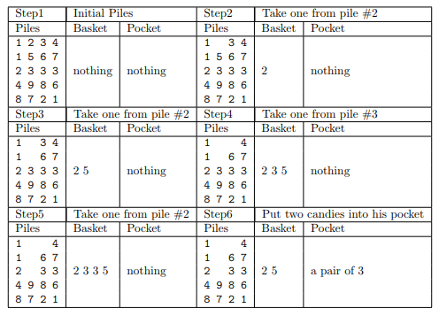

# Free Candies

## 题目描述

Little Bob is playing a game. He wants to win some candies in it - as many as possible.
There are 4 piles, each pile contains N candies. Bob is given a basket which can hold at most 5
candies. Each time, he puts a candy at the top of one pile into the basket, and if there’re two candies
of the same color in it, he can take both of them outside the basket and put them into his own pocket.
When the basket is full and there are no two candies of the same color, the game ends. If the game is
played perfectly, the game will end with no candies left in the piles.  
For example, Bob may play this game like this (N = 5):  
  
Note that different numbers indicate different colors, there are 20 kinds of colors numbered 1..20.
‘Seems so hard...’ Bob got very much puzzled. How many pairs of candies could he take home at
most?  

## 题目翻译  

有四堆糖果，每堆n个，每颗糖果都有颜色。BOb每次可以任选一堆从堆顶拿出一个放入篮子，篮子最多只能放五颗糖果，但当篮子中出现颜色一样的糖果时，Bob可以将这两个颜色一样的糖果拿出篮子放入自己的口袋里，问BOb最多可以拿到多少对糖果？    

## 输入格式  

The input will contain not more than 10 test cases. Each test case begins with a line containing a single  
integer n(1 ≤ n ≤ 40) representing the height of the piles. In the following n lines, each line contains four integers xi1, xi2, xi3, xi4(in the range 1-20).   
Each integer indicates the color of the corresponding candy. The test case containing n = 0 will terminate the input, you should not give an answer to this case.  

## 输出格式

Output the number of pairs of candies that the cleverest little child can take home. Print your answer
in a single line for each test case.  

## 输入样例

	5  
	1 2 3 4  
	1 5 6 7  
	2 3 3 3  
	4 9 8 6  
	8 7 2 1  
	1  
	1 2 3 4  
	3  
	1 2 3 4  
	5 6 7 8  
	1 2 3 4  
	0  

## 输出样例

	8  
	0  
	3  

## 测试网站

[uva 10118](https://vjudge.net/problem/UVA-10118)  
 
## 题目分析

深度优先搜索，首先考虑暴力解法：把所有拿糖果的可能都枚举一遍，得到最大值。优化：对于已经搜索过的状态，将其值保存下来，当搜索到该状态时，不需要再继续深搜而是直接返回该值。 

深搜过程：四堆，每次有四种选择，选出一个糖果后有两种情况：篮子里有这个颜色，则答案加一，篮子里糖果数减一； 

没有这个颜色，放入篮子，答案不变，糖果数加一。直到篮子里糖果数为5或者所有糖果拿完，深搜结束。  

实现：可以定义一个a[]数组表示第i堆选择到了第几个，dp[a[0]][a[1]][a[2]][a[3]]四维数组用来表示四堆糖果当拿到第a[i]个时得到的最多的对数，可以再定义一个vis[]数组表示该颜色是否已在篮子里，若vis[i]为true表示该颜色在篮子里则拿出来，答案加一，然后将其置为false，若不在将vis[i]置为true。  

## 代码示例

```c++
#include <bits/stdc++.h>
using namespace std;
const int SZ = 50;
int n;
int candy[4][SZ];//保存四堆糖果
int dp[SZ][SZ][SZ][SZ];//表示1 2 3 4 堆分别选到了哪一个最多的对数
int a[4];//记录每堆选择到了第几个
bool vis[SZ];//记录该颜色是否在篮子里
void input() {//输入及初始化
    memset(vis, 0, sizeof(vis));
    memset(a, 0, sizeof(a));
    memset(dp, -1, sizeof(dp));
    for(int i = 0; i < n; ++i) {
        for(int j = 0; j < 4; ++j) {
            scanf("%d", &candy[j][i]);
        }
    }
}
int dfs(int cnt) {
    if(dp[a[0]][a[1]][a[2]][a[3]] != -1) {//如果该状态已经搜索过就直接返回值
        return dp[a[0]][a[1]][a[2]][a[3]];
    }
    if(cnt == 5) {//如果篮子里糖果数为5则返回0
        return dp[a[0]][a[1]][a[2]][a[3]] = 0;
    }
    int ans = 0;
    for(int i = 0; i < 4; ++i) {
        if(a[i] == n)continue;//如果第i堆已经选择到第n个，则选择跳过
        int c = candy[i][a[i]];
        ++a[i];
        if(vis[c]) {//如果篮子里有这个颜色的糖果，答案加一
            vis[c] = false;
            ans = max(ans, dfs(cnt - 1) + 1);
            vis[c] = true;
        } else {//如果有这个颜色的糖果，放入篮子
            vis[c] = true;
            ans = max(ans, dfs(cnt + 1));
            vis[c] = false;
        }
        --a[i];
    }
    return dp[a[0]][a[1]][a[2]][a[3]] = ans;
}


int main() {
    while (cin >> n && n) {
        input();
        printf("%d\n", dfs(0));
    }
    return 0;
}
```
