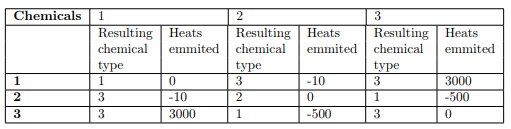

# 记忆化搜索

## Buying Coke   

### 题目翻译  

测试网站[UVA10626](https://vjudge.net/problem/UVA-10626)  

一个人要在自动贩卖机买可乐，一瓶可乐8瑞币，贩卖机只接受1瑞币，5瑞币，10瑞币。自动贩卖机每次会找最少数量的硬币数，如果给了10分钱会找两个1分钱，其他情况同理，给出需要买的可乐的数量n，以及1瑞币，5瑞币，10瑞币的个数，    

问最少投几次硬币可以买到n瓶可乐，假设钱一定足够。 贩卖机一次只能买一瓶，意思是一次只能出来一瓶可乐，买下一瓶需要再次投币。  
	 

### 题目分析  	

对于一次购买行为，有如下几种投硬币方案：  

- 投1个10分的，余2个1分    
- 投1个10分的+3个1分的，余1个5分  
- 投2个5分的，余2个1分  
- 投1个5分的+3个1分的  
- 投8个1分的   

深度优先搜索这五种情况，对于已经搜索过的状态，将其值保存下来，当搜索到该状态时，不需要再继续深搜而是直接返回该值。

注意购买可乐会找回硬币，所以开数组dp时要在题目范围的基础上增加最大硬币数量。

### 代码示例  

```c++	
#include <iostream>
#include <cstdio>
#include <algorithm>
#include <cstring>
using namespace std;
#define Max 110
#define INF 0x3f3f3f3f
int c;
int n;
int n1, n5, n10;
int dp[800][200][100];//dp[i][j][k]表示面值为1、5、10的硬币剩余i、j、k个时，投入的硬币数量的最小值

int solve(int n, int n1, int n5, int n10)
{
    if(n == 0)return 0;//当买完可乐时返回0
    if(dp[n1][n5][n10] != INF)
    {
        return dp[n1][n5][n10];//此状态已经搜过，返回该值
    }
    int ans = INF;
    int now;
    if(n10 >= 1)
    {//投一个面值10，面值1加2个，需要投一次币
        now = solve(n-1, n1+2, n5, n10-1) + 1;
        ans = min(ans, now);
    }
    if(n1 >= 3 && n10 >= 1)
    {//投一个面值10和三个面值1，面值5加1个，需要投四次币
        now = solve(n-1, n1-3, n5+1, n10-1) + 4;
        ans = min(ans, now);
    }
    if(n5 >= 2)
    {//投两个面值5，面值1加2个，需要投两次币
        now = solve(n-1, n1+2, n5-2, n10) + 2;
        ans = min(ans, now);
    }
    if(n5 >= 1 && n1 >= 3)
    {//投一个面值5和三个面值1，需要投四次币
        now = solve(n-1, n1-3, n5-1, n10) + 4;
        ans = min(ans, now);
    }
    if(n1 >= 8)
    {//投一个面值1，需要投八次币
        now = solve(n-1, n1-8, n5, n10) + 8;
        ans = min(ans, now);
    }
    dp[n1][n5][n10] = ans;
    return ans;
}
int main()
{
    int numberofcase;
    scanf("%d", &numberofcase);
    while(numberofcase--)
    {
        scanf("%d%d%d%d", &n, &n1, &n5, &n10);
        memset(dp, INF, sizeof(dp));
        cout << solve(n, n1, n5, n10) << endl;
    }
    return 0;
}
```


## Chemical Reaction

测试网站[uva 10604](https://vjudge.net/problem/UVA-10604)  

### 题目描述
In a chemists lab, there are several types of chemicals in tubes. The chemist wants to mix all these
chemicals together, two chemicals at a time. Whenever two chemicals are mixed, some heat is generated
and released into the air and the mixed chemical is a known chemical of possibly other type than the
original two. The resulting chemical type and the amount of heats emitted can looked up in the chemical
mixture table.  
  
For example, in the above chemical mixture table, there are three types of chemicals: 1, 2, and 3. If
you mix chemicals 1 and 3, they produce +3000 units of heat and turn into chemical 3. Sometimes, the
heat generated can be negative. For instance, you can mix 2 and 3 and they turn into chemical 1 and in
the meantime, cool down the lab by 500 units of heat. Since the chemist lacks funding to buy necessary
equipments to protect himself from the heat generated, it is utmost important to find a way to mix all the
chemicals together that produces the least total heat, regardless of the final chemical type. For example,
suppose the lab has four tubes containing chemicals of types 1, 2, 2, and 3. If the chemicals are mixed
in the parenthesize order of ((12)(23)), it will produce (−10) + (−500) + (3000) = 2490 units of heat.
However, if the chemicals are mixed in the (2(1(23))) order, it will produce (−500) + 0 + (−10) = −510
units of heat, which is also the least total heat possible.

### 题目翻译  

有m种化学原料，原料两两融合会产生新的原料和释放热量，现给出反应的式子和热量的变化，还有k个试管存放的原料，问怎样融合使得产生的热量最少？

### 题目分析  

深度优先搜索，首先考虑暴力解法：把所有原料融合顺序的可能都枚举一遍，得到最小值。优化：对于已经搜索过的状态，将其值保存下来，  当搜索到该状态时，不需要再继续深搜而是直接返回该值。  

深搜过程：将原料两两枚举，只要该原料数量大于0，则将其融合，直到所有原料数量为0，返回每种顺序的融合产生的热量的最小值。

实现：可以定义一个`a[]`数组保存每种原料的数目，`dp[a[1]][a[2]][a[3]][a[4]][a[5]][a[6]]`六维数组(原料种数最多不超过6种)  
用来表示六种原料当还剩`a[i]`个时产生的最小的热量。

### 代码示例
```c++
#include <bits/stdc++.h>
using namespace std;
const int SZ = 12;
int g_n, g_k;
int c[SZ][SZ], d[SZ][SZ];//c[i][j]保存i和j融合生产的化学原料，d[i][j]保存i和j融合释放的热量
int n[SZ];
int a[SZ];//a[i]保存i原料的数目
int dp[SZ][SZ][SZ][SZ][SZ][SZ];//保存当每种原料还剩a[i]时产生的热量
void input() {//输入及初始化
    memset(dp, -1, sizeof(dp));
    memset(a, 0, sizeof(a));
    cin >> g_n;
    for(int i = 1; i <= g_n; ++i) {
        for(int j = 1; j <= g_n; ++j) {
            scanf("%d%d", &c[i][j], &d[i][j]);
        }
    }
    cin >> g_k;
    for(int i = 1; i <= g_k; ++i) {
        scanf("%d", &n[i]);
        ++a[n[i]];//统计i原料的数目
    }
}
int dfs(int k) {
    if(dp[a[1]][a[2]][a[3]][a[4]][a[5]][a[6]] != -1)//如果该状态已经搜索过就直接返回值
        return dp[a[1]][a[2]][a[3]][a[4]][a[5]][a[6]];
    if(k == 1)return 0;//如果只剩一个原料返回0
    int ct = INT_MAX;
    for(int i = 1; i <= g_n; ++i) {//搜索所有融合情况
        for(int j = 1; j <= g_n; ++j) {
            if(i == j && a[i] < 2)continue;//如果数量不够两个则跳过
            if(a[i] > 0 && a[j] > 0) {
                --a[i], --a[j], ++a[c[i][j]];//够的话，让每种原料数量减一，融合生成的原料数量加一
                ct = min(ct, dfs(k - 1) + d[i][j]);//热量加上i和j融合释放的热量
                ++a[i], ++a[j], --a[c[i][j]];
            }
        }
    }
    return dp[a[1]][a[2]][a[3]][a[4]][a[5]][a[6]] = ct;
}
int main() {
    int t;
    cin >> t;
    while(t --) {
        input();
        printf("%d\n", dfs(g_k));
        char ch;
        cin >> ch;
    }
    return 0;
}
```

## Free Candies

测试网站[uva 10118](https://vjudge.net/problem/UVA-10118)  

### 题目描述

Little Bob is playing a game. He wants to win some candies in it - as many as possible.
There are 4 piles, each pile contains N candies. Bob is given a basket which can hold at most 5
candies. Each time, he puts a candy at the top of one pile into the basket, and if there’re two candies
of the same color in it, he can take both of them outside the basket and put them into his own pocket.
When the basket is full and there are no two candies of the same color, the game ends. If the game is
played perfectly, the game will end with no candies left in the piles.  
For example, Bob may play this game like this (N = 5):  
  
Note that different numbers indicate different colors, there are 20 kinds of colors numbered 1..20.
‘Seems so hard...’ Bob got very much puzzled. How many pairs of candies could he take home at
most?  

### 题目翻译  

有四堆糖果，每堆n个，每颗糖果都有颜色。BOb每次可以任选一堆从堆顶拿出一个放入篮子，篮子最多只能放五颗糖果，但当篮子中出现颜色一样的糖果时，Bob可以将这两个颜色一样的糖果拿出篮子放入自己的口袋里，问BOb最多可以拿到多少对糖果？
 
### 题目分析

深度优先搜索，首先考虑暴力解法：把所有拿糖果的可能都枚举一遍，得到最大值。优化：对于已经搜索过的状态，将其值保存下来，当搜索到该状态时，不需要再继续深搜而是直接返回该值。 

深搜过程：四堆，每次有四种选择，选出一个糖果后有两种情况：篮子里有这个颜色，则答案加一，篮子里糖果数减一； 

没有这个颜色，放入篮子，答案不变，糖果数加一。直到篮子里糖果数为5或者所有糖果拿完，深搜结束。  

实现：可以定义一个a[]数组表示第i堆选择到了第几个，dp[a[0]][a[1]][a[2]][a[3]]四维数组用来表示四堆糖果当拿到第a[i]个时得到的最多的对数，可以再定义一个vis[]数组表示该颜色是否已在篮子里，若vis[i]为true表示该颜色在篮子里则拿出来，答案加一，然后将其置为false，若不在将vis[i]置为true。  

### 代码示例

```c++
#include <bits/stdc++.h>
using namespace std;
const int SZ = 50;
int n;
int candy[4][SZ];//保存四堆糖果
int dp[SZ][SZ][SZ][SZ];//表示1 2 3 4 堆分别选到了哪一个最多的对数
int a[4];//记录每堆选择到了第几个
bool vis[SZ];//记录该颜色是否在篮子里
void input() {//输入及初始化
    memset(vis, 0, sizeof(vis));
    memset(a, 0, sizeof(a));
    memset(dp, -1, sizeof(dp));
    for(int i = 0; i < n; ++i) {
        for(int j = 0; j < 4; ++j) {
            scanf("%d", &candy[j][i]);
        }
    }
}
int dfs(int cnt) {
    if(dp[a[0]][a[1]][a[2]][a[3]] != -1) {//如果该状态已经搜索过就直接返回值
        return dp[a[0]][a[1]][a[2]][a[3]];
    }
    if(cnt == 5) {//如果篮子里糖果数为5则返回0
        return dp[a[0]][a[1]][a[2]][a[3]] = 0;
    }
    int ans = 0;
    for(int i = 0; i < 4; ++i) {
        if(a[i] == n)continue;//如果第i堆已经选择到第n个，则选择跳过
        int c = candy[i][a[i]];
        ++a[i];
        if(vis[c]) {//如果篮子里有这个颜色的糖果，答案加一
            vis[c] = false;
            ans = max(ans, dfs(cnt - 1) + 1);
            vis[c] = true;
        } else {//如果有这个颜色的糖果，放入篮子
            vis[c] = true;
            ans = max(ans, dfs(cnt + 1));
            vis[c] = false;
        }
        --a[i];
    }
    return dp[a[0]][a[1]][a[2]][a[3]] = ans;
}


int main() {
    while (cin >> n && n) {
        input();
        printf("%d\n", dfs(0));
    }
    return 0;
}
```
