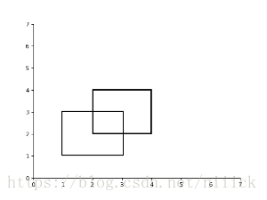
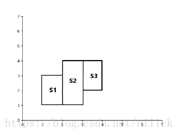
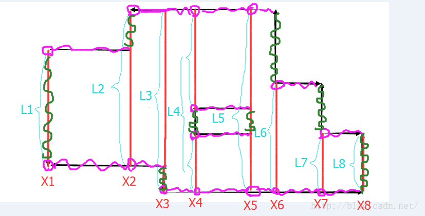

# 线段树2

矩形面积与周长

## Atlantis  

测试网站[poj1151](https://vjudge.net/problem/POJ-1151) 

### 题目翻译  

现在有些地图描述了亚特兰蒂斯的不同区域，要求出亚特兰蒂斯的总面积。  
 	 
### 题目分析  	

这道题考察的是扫描线求面积加离散化。  
先简单说一下扫描线是怎么求解矩形面积的：  
例如下图 ，给出：`n=2` ，矩形1: `(1,1) (3,3)` ，矩形2: `(2,2) (4,4)`  
   
我们将其看成这样的几个矩形和：  
  
`ans = s1+s2+s3；s1 = (x2-x1)*len`
所以`ans = ∑(Xi+1−Xi)*len`，len为有效长度。  
具体做法为：记录每条纵边并按x坐标升序排序，依次遍历每条纵边，当扫描到x1，求y的有效长度，进而求出x1与后继扫描线之间的面积  
这里我们用线段树来维护有效长度，具体做法如下：    
设一个矩形表示为`(x1,y1)(x2,y2)` ，我们记录这个矩形的扫描线为两个四元组 ，`(x1,y1,y2,k=1)(x2,y1,y2,k=−1)`其中左边界（入边）记录的扫描线k=1，右边界（出边）则为-1，
将这些扫描线按x升序排序，定义`cov[i]=v`表示y轴上i共被覆盖了v次 ，设当前遍历到的扫描线为`(xi, yi1, yi2,k)`, 我们令`cov[yi1]~cov[yi2]`都加k，即更新此时的覆盖情况，
那么此时有`len=−1+∑cov[i]>0`, 然后更新 `ans+=(Xi+1−Xi)*len`。  
本题的数据均为浮点数，所以要离散化，具体做法见代码。

### 代码示例  
```c++	
#include<iostream>
#include <cstring>
#include<cstdio>
#include<algorithm>
using namespace std;
#define Max 210
int cov[Max<<2];
double len[Max<<2];
struct Edge{
    double x, y1, y2;
    int k;
};
Edge eg[Max<<1];
double y[Max<<1];
void pushup(int l, int r, int rt){
    if(cov[rt] > 0)len[rt] = y[r+1] - y[l];//将一个点理解为这个点到其下个点之间的线段，所以r+1
    else if(l == r)len[rt] = 0;
    else len[rt] = len[rt<<1] + len[rt<<1|1];
}
//更新ll-rr之间的值
void update(int ll, int rr, int val, int l, int r, int rt){
    if(ll <= l && r <= rr){
        cov[rt] += val;
        pushup(l, r, rt);
        return;
    }
    int m = (l+r)>>1;
    if(ll<=m)update(ll, rr, val, l, m, rt<<1);
    if(rr>m)update(ll, rr, val, m+1 ,r, rt<<1|1);
    pushup(l, r, rt);
}
//将扫描线按x从小到大排序
bool cmp(Edge a, Edge b){
    return a.x < b.x;
}
int main(){
    int n, cs = 0;
    while(scanf("%d", &n) && n!=0){
        int k = 0;
        double x1, y1, x2, y2;
        for(int i=0; i<n; i++){
            scanf("%lf%lf%lf%lf", &x1, &y1, &x2, &y2);
            y[k] = y1;//离散化
            eg[k].x = x1, eg[k].y1 = y1, eg[k].y2 = y2, eg[k].k = 1;//存储扫描线的横坐标、两个纵坐标及其为入边还是出边
            k ++;
            y[k] = y2;
            eg[k].x = x2, eg[k].y1 = y1, eg[k].y2 = y2, eg[k].k = -1;
            k ++;
        }
        sort(y, y+k);//按y的值升序排序
        sort(eg, eg+k, cmp);//将扫描线按x的值从小到大排序
        int t = unique(y, y+k) - y;//给y去重，以建树
        memset(cov, 0, sizeof(cov));
        memset(len, 0 ,sizeof(len));
        double ans = 0.0;
        for(int i=0; i<k; i++){
            int ll = lower_bound(y, y+t, eg[i].y1) - y;//在离散化表中找到当前扫描线的y的相应位置
            int rr = lower_bound(y, y+t, eg[i].y2) - y;
            update(ll, rr-1, eg[i].k, 0, t, 1);//更新有效长度的值
            ans += (eg[i+1].x - eg[i].x) * len[1];//更新答案
        }
        printf("Test case #%d\n", ++cs);
        printf("Total explored area: %.2lf\n\n", ans);
    }
return 0;
}
```

## Picture     

测试网站[poj1177](https://vjudge.net/problem/POJ-1177)    

### 题目描述  

A number of rectangular posters, photographs and other pictures of the same shape are pasted on a wall. Their sides are all vertical or horizontal. Each rectangle can be partially or totally covered by the others. The length of the boundary of the union of all rectangles is called the perimeter. 

Write a program to calculate the perimeter. An example with 7 rectangles is shown in Figure 1.   

  

The corresponding boundary is the whole set of line segments drawn in Figure 2.  

  

The vertices of all rectangles have integer coordinates.   

### 题目翻译  

现在在一面墙上有许多海报、照片，它们完全或部分覆盖，这些海报和照片都是矩形，定义这些矩形边界的交集为周长，要求计算出它们的周长。  

### 题目分析  	

这道题考察的是扫描线求周长加离散化。  
要求题目例子中的周长也就是求下图中的绿线和紫线的长度和。  
  
由图可以观察到，绿色边的长度其实就是L的变化值。要计算紫色边，其实就是计算L的线段是由几个线段组成的，每个线段会贡献两个端点（紫色圆圈），而每个端点都会向右延伸出一条紫色边一直到下一个X值。
L的变化值就是线段树维护的整体区间长度的变化值，只要记录一下上一次整体区间的值算一下当前的长度的差即可。紫色边需要我们维护的是整体区间由几个互不相交的线段覆盖，维护好这个值num,
那么x方向的周长就是`(Xi+1-Xi)*2*num`。
现在我们在原来扫描线的基础上再加三个数组：  
`bool lt[Max<<2], rit[Max<<2];` 记录该区间的左右端点是否被覆盖，便于合并区间  
`int num[Max<<2];` 记录整个区间被几条互不相交的线段覆盖  
具体维护做法见代码中的`pushup`函数。  
本题的数据存在负数，所以要离散化，具体做法见代码。  

### 代码示例  

```c++	
#include<iostream>
#include <cstring>
#include<cstdio>
#include<algorithm>
using namespace std;
#define Max 5010
int len[Max<<2];//记录整个区间的有效长度
int sum[Max<<2];//记录整个区间被整体覆盖了几次
bool lt[Max<<2], rit[Max<<2];//记录该区间的左右端点是否被覆盖，便于合并区间
int num[Max<<2];//记录整个区间被几条互不相交的线段覆盖
struct Edge{
    int x, y1, y2;
    int k;
};
Edge eg[Max<<1];
int y[Max<<1];
void pushup(int l, int r, int rt){
    if(sum[rt] > 0){
        len[rt] = y[r+1] - y[l];
        num[rt] = 1;
        lt[rt] = rit[rt] = 1;
    }
    else if(l == r){
        len[rt] = 0;
        num[rt] = 0;
        lt[rt] = rit[rt] = 0;
    }
    else{
        len[rt] = len[rt<<1] + len[rt<<1|1];
        num[rt] = num[rt<<1] + num[rt<<1|1];
        if(rit[rt<<1]==1 && lt[rt<<1|1]==1)num[rt] --;
        lt[rt] = lt[rt<<1];
        rit[rt] = rit[rt<<1|1];
    }
}
//更新ll-rr之间的值
void update(int ll, int rr, int val, int l, int r, int rt){
    if(ll <= l && r <= rr){
        sum[rt] += val;
        pushup(l, r, rt);
        return;
    }
    int m = (l+r)>>1;
    if(ll<=m)update(ll, rr, val, l, m, rt<<1);
    if(rr>m)update(ll, rr, val, m+1 ,r, rt<<1|1);
    pushup(l, r, rt);
}
//将扫描线按x从小到大排序
bool cmp(Edge a, Edge b){
    return a.x < b.x;
}
int main(){
    int n;
    while(scanf("%d", &n)!=EOF){
        int k = 0;
        int x1, y1, x2, y2;
        for(int i=0; i<n; i++){
            scanf("%d%d%d%d", &x1, &y1, &x2, &y2);
            y[k] = y1;//离散化
            eg[k].x = x1, eg[k].y1 = y1, eg[k].y2 = y2, eg[k].k = 1;//存储扫描线的横坐标、两个纵坐标及其为入边还是出边
            k ++;
            y[k] = y2;
            eg[k].x = x2, eg[k].y1 = y1, eg[k].y2 = y2, eg[k].k = -1;
            k ++;
        }
        sort(y, y+k);//按y的值升序排序
        sort(eg, eg+k, cmp);//将扫描线按x的值从小到大排序
        eg[k].x = eg[k-1].x;
        int t = unique(y, y+k) - y;//给y去重，以建树
        memset(sum, 0, sizeof(sum));
        memset(len, 0 ,sizeof(len));
        memset(num, 0, sizeof(num));
        memset(lt, 0, sizeof(lt));
        memset(rit, 0, sizeof(rit));
        int ans = 0, l1=0;
        for(int i=0; i<k; i++){
            int ll = lower_bound(y, y+t, eg[i].y1) - y;//在离散化表中找到当前扫描线的y的相应位置
            int rr = lower_bound(y, y+t, eg[i].y2) - y;
            update(ll, rr-1, eg[i].k, 0, t, 1);//更新有效长度的值
            ans += abs(len[1]-l1) + (eg[i+1].x-eg[i].x)*2*num[1];//更新答案
            l1 = len[1];
        }
        cout << ans << endl;
    }
return 0;
}
```