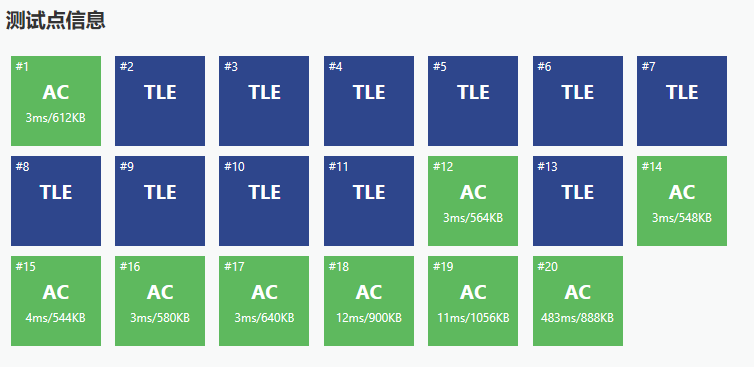

# 二分与模拟

测试网站[洛谷1083 借教室](https://www.luogu.org/problemnew/show/P1083)

## P1083 借教室

### 题目描述

在大学期间，经常需要租借教室。大到院系举办活动，小到学习小组自习讨论，都需要向学校申请借教室。教室的大小功能不同，借教室人的身份不同，借教室的手续也不一样。

面对海量租借教室的信息，我们自然希望编程解决这个问题。

我们需要处理接下来`n`天的借教室信息，其中第`i`天学校有`r[i]`个教室可供租借。共有`m` 份订单，每份订单用三个正整数描述，分别为`d[j]`, `s[j]`, `t[j\]`，表示某租借者需要从第 `s[j]` 天到第 `t[j]` 天租借教室(包括第`s[j]`天和第`t[j]`天)，每天需要租借`d[j]`个教室。

我们假定，租借者对教室的大小、地点没有要求。即对于每份订单，我们只需要每天提供`d[j]`个教室，而它们具体是哪些教室，每天是否是相同的教室则不用考虑。

借教室的原则是先到先得，也就是说我们要按照订单的先后顺序依次为每份订单分配教室。如果在分配的过程中遇到一份订单无法完全满足，则需要停止教室的分配，通知当前申请人修改订单。这里的无法满足指从第 `s[j]` 天到第 `t[j]` 天中有至少一天剩余的教室数量不足 `d[j]` 个。

现在我们需要知道，是否会有订单无法完全满足。如果有，需要通知哪一个申请人修改订单。

### 输入格式

第一行包含两个正整数`n`,`m`，表示天数和订单的数量。

第二行包含`n`个正整数，其中第`i`个数为`r[i]`，表示第`i`天可用于租借的教室数量。

接下来有`m`行，每行包含三个正整数`d[j]`, `s[j]`,`t[j]`, 表示租借的数量，租借开始、结束分别在第几天。

每行相邻的两个数之间均用一个空格隔开。天数与订单均用从`1`开始的整数编号。

### 输出格式

如果所有订单均可满足，则输出只有一行，包含一个整数`0`。否则（订单无法完全满足）
输出两行，第一行输出一个负整数`-1`，第二行输出需要修改订单的申请人编号。

### 输入样例

    4 3 
    2 5 4 3 
    2 1 3 
    3 2 4 
    4 2 4

### 输出样例

    -1 
    2
    
### 数据范围

- 对于10%的数据，有`1 ≤ n, m ≤ 10`;
- 对于30%的数据，有`1 ≤ n, m ≤ 1000`;
- 对于70%的数据，有`1 ≤ n, m ≤ 10^5`;
- 对于100%的数据，有`1 ≤ n, m ≤ 10^6, 0 ≤ r[i], d[j] ≤ 10^9, 1 ≤ s[j] ≤ t[j] ≤n`.


### 题目分析
   
首先我们能够想到的做法肯定是暴力，我们可以暴力比较当前订单所需求的某一天教室数量和该天实际剩余数量。

代码如下：
   
```c++
#include <queue>
#include <cstdio>
#include <cstring>
#include <algorithm>
using namespace std;
#define mst(a,b) memset((a),(b),sizeof(a))
#define f(i,a,b) for(int i=(a);i<=(b);++i)
#define rush() int T;scanf("%d",&T);while(T--)

typedef long long ll;
const int maxn= 1000005;
const ll mod = 1e9+7;
const int INF = 0x3f3f3f3f;
const double eps = 1e-6;

int n,m;
int a[maxn];

int main()
{
    scanf("%d%d",&n,&m);
    for(int i=1;i<=n;i++) scanf("%d",&a[i]);
    for(int i=1;i<=m;i++)
    {
        int x,l,r;
        scanf("%d%d%d",&x,&l,&r);
        for(int j=l;j<=r;j++)
        {
            a[j]-=x;
            if(a[j]<0) return printf("-1\n%d\n",i),0;
        }
    }
    puts("0");
}

```
  
提交至测试网站，可以发现有部分数据超时，只得到了45分。



经过分析，这样的暴力做法时间复杂度为`O(n * m)`,显然会超时。

于是我们考虑问题存在的性质，易得：如果第`j`个订单可满足的话，第`i`个订单一定可满足。`(i<j)`

那么这个问题就具有了单调性，我们可以利用这个性质对第一个不可满足的订单位置二分求解，即我们每次去判断前`mid`个订单能否满足(利用差分前缀和的性质)，如果满足，答案在`[mid+1,r]`内，否则在`[l,mid]`内。时间复杂度`O(mlogn)`。
    
## 代码示例

```c++
#include <queue>
#include <cstdio>
#include <cstring>
#include <algorithm>
using namespace std;
#define mst(a,b) memset((a),(b),sizeof(a))
#define rush() int T;scanf("%d",&T);while(T--)

typedef long long ll;
const int maxn= 1000005;
const ll mod = 1e9+7;
const int INF = 0x3f3f3f3f;
const double eps = 1e-6;

int n,m;
ll a[maxn],x[maxn];
int s[maxn],t[maxn];
ll sum[maxn];

bool check(int pos)
{
    mst(sum,0);
    for(int i=1;i<=pos;i++)
    {
        sum[s[i]]+=x[i];
        sum[t[i]+1]-=x[i];
    }
    ll now=0;
    for(int i=1;i<=n;i++)
    {
        now+=sum[i];
        if(now>a[i]) return 1;   //需求数大于实际数量
    }
    return 0;
}

int main()
{
    scanf("%d%d",&n,&m);
    for(int i=1;i<=n;i++) scanf("%lld",&a[i]);
    for(int i=1;i<=m;i++)
    {
        scanf("%lld%d%d",&x[i],&s[i],&t[i]);
    }
    int ans=-1;
    int l=1,r=m;
    while(l<=r)
    {
        int mid=(l+r)/2;
        if(check(mid))    //前mid个订单不能完全满足，则答案应该更小
        {
            ans=mid;
            r=mid-1;
        }
        else l=mid+1;    
    }
    if(ans==-1) puts("0");
    else printf("-1\n%d\n",ans);
}

```
   

## 聪明的质监员 

[luogu 1314](https://www.luogu.org/problemnew/show/P1314)

### 题意

RT

### 思路

容易发现，`W`越大,矿产的检验结果`Y`越大，那么我们就可以根据这个性质进行二分。

当然，对于`Y`值的计算，需要用前缀和优化。


### 代码

```c++
#include <bits/stdc++.h>
using namespace std;
#define mst(a,b) memset((a),(b),sizeof(a))
#define rush() int T;scanf("%d",&T);while(T--)

typedef long long ll;
const int maxn = 200005;
const ll INF = 1e18;
const ll mod=1e9+7;
const double eps = 1e-9;

int n,m;
ll S;
int w[maxn],num[maxn];
int l[maxn],r[maxn];
ll val[maxn],sum[maxn];

ll cal(int x)
{
    ll tmp=0;
    for(int i=1;i<=n;i++)
    {
        sum[i]=sum[i-1];
        num[i]=num[i-1];
        if(w[i]>=x)
        {
            sum[i]+=val[i];
            num[i]++;
        }
    }
    for(int i=0;i<m;i++)
    {
        tmp+=(sum[r[i]]-sum[l[i]-1])*(num[r[i]]-num[l[i]-1]);
    }
    return tmp;
}

int main()
{
    scanf("%d%d%lld",&n,&m,&S);
    int Max=0;
    for(int i=1;i<=n;i++)
    {
        scanf("%d%lld",&w[i],&val[i]);
        Max=max(Max,w[i]);
    }
    for(int i=0;i<m;i++)
    {
        scanf("%d%d",&l[i],&r[i]);
    }
    int l=0,r=Max;
    ll ans=1e18;
    while(l<=r)
    {
        int mid=(l+r)/2;
        ll tmp=cal(mid);
        ans=min(ans,abs(tmp-S));
        if(tmp<S) r=mid-1;
        else l=mid+1;
    }
    printf("%lld\n",ans);
}

```

## Coffee Break

[Codeforces 1041C](https://codeforces.com/problemset/problem/1041/C)


### 题意

`Monocarp`一天需要上班`m`分钟，给出`n`个`ai`，表示`Monocarp`想在第`ai`分钟喝咖啡，每次喝咖啡需要`1`分钟

为了不影响工作，他的`boss`要求他两次喝咖啡的时间间隔在`d`分钟及以上。

`Monocarp`想要在每个时间点都喝过咖啡(可以在不同天)，但是他想完成这个愿望的时间最短，问最少需要几天，并输出每个时间点的咖啡是在第几天喝的。

### 思路

显然，每一天我们肯定先选择时间最靠前的时间点`tmp`，然后再往后找最靠前的在`tmp+d+1`的时间点即可，这个过程可以用二分`(lower_bound)`

找不到那就换新的一天重复这个过程，直到全部喝完。

整个过程时间点用`set`维护。


### 代码

```c++
#include <cstdio>
#include <bits/stdc++.h>
#include <map>
#include <cstring>
#include <algorithm>
using namespace std;
#define mst(a,b) memset((a),(b),sizeof(a))
#define rush() int T;scanf("%d",&T);while(T--)

typedef long long ll;
const int maxn = 200005;
const ll INF = 1e18;
const ll mod=1e9+7;
const double eps = 1e-9;

int n,m,d;
int a[maxn];
set<int>s;
map<int,int>mp;
int ans[maxn];

int main()
{
    scanf("%d%d%d",&n,&m,&d);
    for(int i=0;i<n;i++)
    {
        int x;
        scanf("%d",&x);
        mp[x]=i;
        s.insert(x);
    }
    int now=0;
    int pos=-1;
    while(s.size())
    {
        now++;
        int tmp=*(s.begin());
        s.erase(tmp);
        ans[mp[tmp]]=now;
        pos=tmp;
        while(s.size())
        {
            set<int>::iterator it=s.lower_bound(tmp+d+1);
            if(it==s.end()) break;
            tmp=*it;
            ans[mp[tmp]]=now;
            pos=tmp;
            s.erase(tmp);
        }
    }
    printf("%d\n",now);
    for(int i=0;i<n;i++) printf("%d ",ans[i]);
    puts("");
}
```
