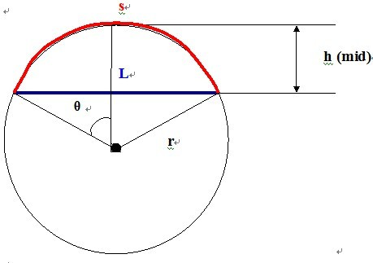

 # 膨胀的木棍


## 描述

当长度为`L`的一根细木棍的温度升高 `n` 度，它会膨胀到新的长度`L'=(1+n*C)*L`，其中`C`是热膨胀系数。当一根细木棍被嵌在两堵墙之间被加热，它将膨胀形成弓形的弧，而这个弓形的弦恰好是未加热前木棍的原始位置。你的任务是计算木棍中心的偏移距离。


## 输入

三个非负实数：木棍初始长度（单位：毫米），温度变化（单位：度），以及材料的热膨胀系数。
保证木棍不会膨胀到超过原始长度的`1.5`倍。

## 输出

木棍中心的偏移距离（单位：毫米），保留到小数点后第三位。

## 样例输入
	
	1000 100 0.0001

## 样例输出

	61.329

## 来源

[NOI Openjudge 1.11 二分查找](http://noi.openjudge.cn/ch0111/09/)

## 思路

设偏移距离为`x`，用勾股定理计算半径，算出弧长判断弧长与实际的偏差，调整边界。



## Code

```c++
#include<bits/stdc++.h>
double L,n,c,b,b1,l,r,R,hd;
int main()
{
    cin>>l>>n>>c;
	b=(1+n*c)*L;
    L/=2;
    b/=2;//计算出膨胀后的木棍
	l=0;r=L;//膨胀的偏移距离最小为0，最大本为1.5L，但取略大值L/2*π，所以最大值取L/2，L已经平分
	while(l+1e-4<=r)//循环条件，注意精度值（保留到小数点后第三位）
	{
		double mid=(l+r)/2;
		R=(L*L+mid*mid)/(2*mid);//勾股定理化简(R-mid)²+L²=R²
		hd=asin(L/R);//计算弧度，正弦定理
		b1=hd*R;//弧长计算公式
		if(b1<b)	l=mid;//如果小于，证明取值偏小，修改边界
		else r=mid;
	}
	printf("%.3lf",l);
}
```
