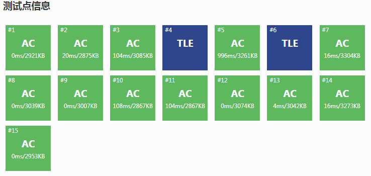

# A % B Problem


## 【题目描述】

区间质数个数

**【输入格式】**

一行两个整数 询问次数  `n`，范围`m`

接下来`n`行，每行两个整数 `l, r` 表示区间

**【输出格式】**

对于每次询问输出个数 `t` ，如 `l` 或 `r` 不属于 `[1,m]` 范围内则输出 `Crossing the
line`

**【输入样例】**

    2 5
    1 3
    2 6

**【输出样例】**

    2
    Crossing the line

**【说明】**
- 对于20%的数据 `1 <= n <= 10 1 <= m <= 10`
- 对于100%的数据 `1 <= n <= 1000, 1 <= m <= 10^6, -10^9 <= l <= r <= 10^9, 1 <= t <= 10^6`

**【测试网站】**

[luogu1865](https://www.luogu.org/problemnew/show/P1865#sub)


## 题目分析

题目要求我们找给定范围内的素数个数，而题目中m的范围非常大，显然求解质数时使用欧拉筛法效率最高。

利用 `while()` 循环遍历每一次的询问,再使用欧拉筛法求解`[2, r]`以及`[2, l]`之间的质数个数，然后相减。（注意范围左侧`l`要减去`1`之后求质数个数，因为如果`l`是质数时，所求范围质数包括`l`),此时时间复杂度为`n * m`。欧拉筛法返回的值是`[2, n]`之间的质数个数。

```c++
while(n--){ // 遍历询问次数 
    cin>>l>>r; //输入左右区间 
    if(l或r∉[1,m]) cout << "Crossing the line" << endl; //越界 
    if(l=1) cout << Euler_prime(r) << endl; //质数筛法从2开始筛 
    else cout << Euler_prime(r)-Euler_prime(l-1) << endl; //两侧质数个数相减 
} 
```

提交至测试网站，可以发现有部分数据超时。




可以发现，在处理每组数据时都使用欧拉筛法求解数组个数，有大量的数据被重复求解。

我们是否可以只使用一次欧拉筛法？

求解出最大范围即`[2, m]`之间的素数个数，并在使用欧拉筛法遍历时记录下来当前范围内的素数个数，并保存到数组中。

具体来说，定义数组`sum[maxn]`, 在`int Euler_prime(int k)`函数中：


```c++
for (int i = 2; i <= k; i++){ //外层循环从2~n开始遍历 
    if (i是素数){
        prime[tot++] = i; //当前状态是true,记录
        sum[i] = sum[i-1] + 1; //素数个数加1 
    } else sum[i] = sum[i-1]; //素数个数不变 

```

在主函数中，如果`l`和`r`没有越界，直接输出 `sum[r] - sum\[l-1]`。

**【代码示例】**
```c++
#include <cstdio>
#include <iostream>
#include <cstring>
using namespace std;
const int maxn=1e6+1;
bool IsPrime[maxn]; 
int prime[maxn];//记录素数 
int sum[maxn]; //sum[j]记录2-j之间的素数个数 

int  Euler_prime(int k){  
    int tot = 0;
    memset(IsPrime,true,sizeof(IsPrime)); //初始化，默认所有数为质数 
    for (int i = 2;i <= k;i++){  //外层循环从2~n开始遍历 
       if (IsPrime[i]) {
         prime[tot++] = i; //当前状态是true,记录
         sum[i]=sum[i-1]+1; //素数个数加1 
       } else sum[i]=sum[i-1]; //素数个数不变 
    for (int j = 0;j < tot;j++){ //遍历素数表
        if (i*prime[j] > k) break; //超过最大范围，跳出 
        IsPrime[i*prime[j]] = false;//将倍数i倍*某个质数筛除 
        if (i%prime[j] == 0) break;//保证只筛到以prime[j]为最小质因数的数，退出内层循环
        }
    }
}

int main(){
	int l, r, n, m;
    cin >> n >> m; //询问次数，范围 
    Euler_prime(m);
    while(n--){ //遍历询问次数
		cin >> l >> r; //输入左右区间 
		if (l<1 || l>m || r<1 || r>m) cout<<"Crossing the line"<<endl; //越界 
		else cout << sum[r] - sum[l-1] << endl; //两侧质数个数相减 
	 } 
    return 0;
}

```
